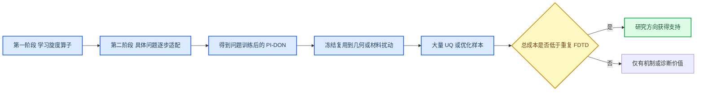
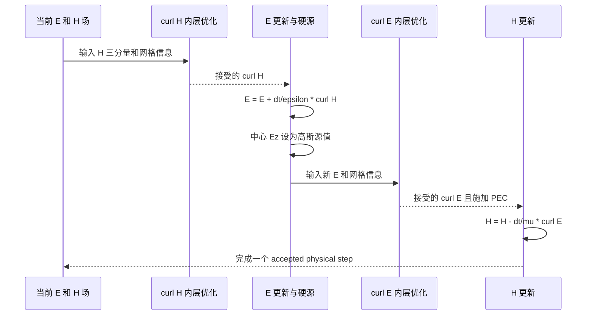
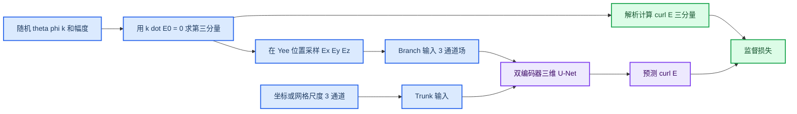
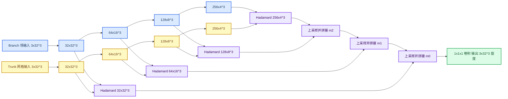
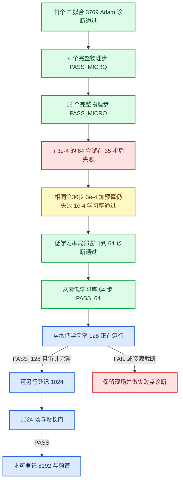

# PI-DON 复现组会讲稿与答辩手册

_面向电磁场与天线方向导师；依据截至 2026-09-16 已回传证据编写。服务器 clean low-lr 128 步任务正在运行，其结果尚未写入本手册。_

## 使用边界

这份材料的目标不是把所有运行都说成成功，而是把“论文主张、我们的实现、实验事实和仍缺的证据”四层分开。科学结论以原始 `summary.json`、`steps.jsonl` 和不可变 checkpoint 为准；旧汇报中的文字只作历史线索。

汇报时统一使用下面四种状态：

| 状态 | 含义 |
| --- | --- |
| PASS | 预先登记的该级科学门通过 |
| FAIL | 已运行，但预先登记的科学门没有通过 |
| RESOURCE_LIMIT / INCOMPLETE | 证据或资源不足，不能判为 PASS 或 FAIL |
| NOT_RUN | 尚未运行，不能用较短实验代替 |

特别注意：`nMAE`、相对 L2 和论文式(5) MRE 是不同指标；精确 Yee 参考只用于生成目标和审计，不能计作 DCO 成绩；代码运行成功也不等于论文机制复现成功。

## 一分钟开场

我复现的是 Qi 与 Sarris 在 2025 年提出的 PI-DON 三维时域电磁建模方法。它不是简单地用一个神经网络直接预测整个时域场，而是先用解析平面波数据训练一个“深度旋度算子” DCO，使网络近似 Maxwell 方程中的空间旋度；随后针对具体腔体，在每个物理时间步内继续反向传播，使网络给出的旋度满足基于 Yee 差分构造的物理损失，再用该旋度更新电场和磁场。

目前我们已经完整实现并跑通第一阶段训练流程，也已经在第二阶段从零开始严格连续推进到 64 个完整时间步，并通过 64 步全场门。这个结果说明逐步适配机制在短程上是可行的，但还不能等同论文的 8192 步结果。当前服务器正在验证同一低学习率配置能否从零连续到 128 步；只有 128 步回传和场门审核通过，才有资格登记 1024 步，仍不能直接宣称完成 8192 步论文复现。

## 研究问题和实际价值

### 论文想解决什么

传统 FDTD 的优势是物理清楚、局部更新快、误差和稳定性理论成熟；不足是每一个几何或材料参数样本都要重新做一次全时域推进。当任务变成大规模不确定性量化、蒙特卡洛分析或设计优化时，重复仿真的总成本很高。

PI-DON 的设想是把计算分成“学习一个可迁移空间算子”和“针对具体问题适配”两部分。若完成一次问题训练后，网络能够在相近几何、材料或大时间步条件下冻结复用，那么前期训练成本有机会被大量后续仿真摊薄。论文真正有吸引力的地方不是单次均匀腔体比 FDTD 快，而是大量相似问题上的摊销收益。

### 为什么对电磁团队有用

可能有价值的场景包括：几何公差分析、介质参数随机性、微带滤波器和超表面单元的批量扫描、基于大量前向仿真的优化与反演。如果训练后冻结复用成立，GPU 可以并行处理多个参数样本，而传统 FDTD 通常需要逐样本推进或依赖大量并行实例。

但必须诚实指出：在当前均匀直角 Yee 网格中，离散旋度本身只是固定的局部差分模板，精确计算很便宜。仅仅“用网络近似已知旋度”并不天然优于 FDTD。研究价值必须由两个更强事实支撑：一是完整长程场和频谱正确；二是完成问题训练后，对新参数的冻结复用收益足以摊销训练成本。当前项目只走到第一个事实的 64 步检查点。

图源：本项目概念示意，根据论文 Sections III–VI 和当前验收逻辑绘制，不是实验结果。

## 电磁理论基础

### 从 Maxwell 旋度方程开始

在各向同性线性介质中，时域 Maxwell 旋度方程可写为

\[
\nabla\times\mathbf{E}=-\mu\frac{\partial\mathbf{H}}{\partial t},
\qquad
\nabla\times\mathbf{H}=\epsilon\frac{\partial\mathbf{E}}{\partial t}+\mathbf{J}.
\]

当前空气 PEC 腔体内部取 \(\epsilon=\epsilon_0\)、\(\mu=\mu_0\)，源通过指定位置的 \(E_z\) 硬赋值加入，而不是把体电流 \(\mathbf J\) 作为单独数组推进。除源点外，更新关系就是

\[
\frac{\partial\mathbf E}{\partial t}=\frac{1}{\epsilon}\nabla\times\mathbf H,
\qquad
\frac{\partial\mathbf H}{\partial t}=-\frac{1}{\mu}\nabla\times\mathbf E.
\]

旋度不是“场的大小”，而是局部环流强度。例如

\[
(\nabla\times\mathbf E)_x=
\frac{\partial E_z}{\partial y}-\frac{\partial E_y}{\partial z}.
\]

因此一个三分量场输入会产生另一个三分量旋度场输出。第一阶段 DCO 学的是 \(\mathbf E\mapsto\nabla\times\mathbf E\) 这种空间算子；第二阶段同一个网络结构也用于 \(\mathbf H\mapsto\nabla\times\mathbf H\)。

### Yee 交错网格为什么重要

Yee 网格把电、磁分量放在单元的不同边或面中心，而不是六个分量都放在同一个节点。这样可以用相邻差分自然构成环路，并保持电磁更新的局部性。

| 分量 | 本项目数组形状 | 典型位置 |
| --- | --- | --- |
| \(E_x\) | \((N,N+1,N+1)\) | \((i+1/2,j,k)\) |
| \(E_y\) | \((N+1,N,N+1)\) | \((i,j+1/2,k)\) |
| \(E_z\) | \((N+1,N+1,N)\) | \((i,j,k+1/2)\) |
| \(H_x\) | \((N+1,N,N)\) | \((i,j+1/2,k+1/2)\) |
| \(H_y\) | \((N,N+1,N)\) | \((i+1/2,j,k+1/2)\) |
| \(H_z\) | \((N,N,N+1)\) | \((i+1/2,j+1/2,k)\) |

代码中的一个例子是

\[
(\nabla\times\mathbf E)_x
=\frac{E_z(i,j+1,k)-E_z(i,j,k)}{\Delta y}
-\frac{E_y(i,j,k+1)-E_y(i,j,k)}{\Delta z}.
\]

源码依据：[fdtd.py](/C:/PI-DON/src/pidon/fdtd.py:51)。导师若问“为什么六个数组形状不同”，答案就是不同分量在 Yee 单元中处于不同交错位置；若强行裁成一个共同小立方体，会丢失合法平面并可能错位。本项目后来专门修正了这一接口。

### 时间推进和蛙跳结构

电场和磁场错开半个时间层，离散更新为

\[
\mathbf E^{n+1}=\mathbf E^n+
\frac{\Delta t}{\epsilon}\left(\nabla_D\times\mathbf H^{n+1/2}\right),
\]

\[
\mathbf H^{n+1/2}=\mathbf H^{n-1/2}-
\frac{\Delta t}{\mu}\left(\nabla_D\times\mathbf E^n\right).
\]

PI-DON 没有丢掉这个 FDTD 时间推进框架。它改变的是空间旋度 \(\nabla_D\times\cdot\) 的获得方式：FDTD 直接使用确定差分；PI-DON 让 DCO 输出旋度，并在每个时间层通过物理损失把网络输出拟合到该步要求。

图源：论文 Algorithm 1 与 [pidon_solve.py](/C:/PI-DON/src/pidon/pidon_solve.py:885) 的当前实现重绘。

### PEC 边界和硬源

理想电导体表面满足切向电场为零。本实现对六个面显式把相应切向 \(E\) 分量清零，见 [fdtd.py](/C:/PI-DON/src/pidon/fdtd.py:108)。中心高斯源采用硬源，即在更新 \(E\) 后直接令源点 \(E_z=g(t)\)。这带来一个重要审计原则：源点值由代码强制写入，所以源点正确不能证明传播正确；必须同时检查源外探针、去源全场和六分量误差。

### CFL 条件和 31 个间隔假设

三维 Yee 网格的稳定时间步满足

\[
\Delta t\leq
\frac{1}{c\sqrt{1/\Delta x^2+1/\Delta y^2+1/\Delta z^2}}.
\]

论文写 50 mm 腔体、每方向 32 cells、训练时间步 3.075 ps。若把 32 解释为 32 个点，即 31 个间隔，则 \(\Delta x=50/31\) mm，取 0.99 倍 CFL 得 3.0751 ps，与论文吻合。当前实现因此用 `n=31` 代表 31 个间隔。这是有数值支持的复现假设，但不是作者明确确认的网格元数据，应在答辩中这样表述。

## 第一阶段：DCO 如何学习旋度

### 训练样本从哪里来

每个样本由若干自由空间平面波叠加：

\[
\mathbf E(\mathbf r)=\sum_m \mathbf E_{0,m}\cos(\mathbf k_m\cdot\mathbf r),
\]

并利用解析关系生成标签：

\[
\nabla\times\mathbf E(\mathbf r)=
-\sum_m (\mathbf k_m\times\mathbf E_{0,m})
\sin(\mathbf k_m\cdot\mathbf r).
\]

横向条件 \(\mathbf k_m\cdot\mathbf E_{0,m}=0\) 保证平面波电场与传播方向正交。论文配置为 \(32^3\)、1000 样本、网格间距 0.3–0.8 mm、波数 0–1048 rad/m，对应约 0–50 GHz；80% 训练、20% 测试。标签是解析旋度，不需要先跑 FDTD 生成监督场。

图源：论文 Eqs. (2)–(4)、Section III-B 与 [gen_data.py](/C:/PI-DON/src/pidon/gen_data.py:82)。

### 网络到底吃什么、吐什么

Branch 输入是三通道场张量，形状为 `B x 3 x Nx x Ny x Nz`。第一阶段是 \((E_x,E_y,E_z)\)，第二阶段拟合 H 时换成 \((H_x,H_y,H_z)\) 的共同网络立方体。Trunk 输入也是三通道，表达空间坐标或网格尺度。输出是三通道 \((\nabla\times\mathbf F)_x,(\nabla\times\mathbf F)_y,(\nabla\times\mathbf F)_z\)，空间尺寸与输入相同。

当前第二阶段使用的旧权重 `dco_lr1e3_300.pt` 是 `levels=4`、`base=32`、`coords=cellsize`、`norm=rms`。其中 `cellsize` 模式把 \((\Delta x,\Delta y,\Delta z)\) 展开为三个常量通道；论文只说明输入场坐标并由 trunk 解码网格尺寸，没有明确说作者也是常量通道，所以这是实现假设，不应冒充原文细节。

### 四层网络逐层输入输出

以下以 \(32^3\) 输入、batch 为 \(B\) 为例。每个 `Block(cin, cout)` 都执行两次 `3x3x3` 卷积与 GELU，并把输入经恒等映射或 `1x1x1` 投影后残差相加。

| 层级 | Branch 输入与输出 | Trunk 输入与输出 | 融合结果 | 物理/AI 含义 |
| --- | --- | --- | --- | --- |
| 输入 | `B x 3 x 32 x 32 x 32` 场 | `B x 3 x 32 x 32 x 32` 网格信息 | 尚未融合 | 两个输入分别回答“场是什么”和“在哪种网格上” |
| Level 0 | `3 -> 32`，空间仍为 \(32^3\) | `3 -> 32`，空间仍为 \(32^3\) | 逐元素 Hadamard 积，`32 x 32^3` | 局部高分辨率特征 |
| Level 1 | max-pool 后 \(16^3\)，`32 -> 64` | 同样到 \(16^3\)，`32 -> 64` | `64 x 16^3` | 感受野扩大，融合场与尺度 |
| Level 2 | max-pool 后 \(8^3\)，`64 -> 128` | 同样到 \(8^3\)，`64 -> 128` | `128 x 8^3` | 中尺度模式 |
| Level 3 | max-pool 后 \(4^3\)，`128 -> 256` | 同样到 \(4^3\)，`128 -> 256` | `256 x 4^3` | 最深层全局上下文 |
| Decoder 2 | 转置卷积 `256 -> 128`，回到 \(8^3\) | 与 Level 2 融合特征拼接 | `256 -> 128` Block | 恢复分辨率并保留跳连信息 |
| Decoder 1 | 转置卷积 `128 -> 64`，回到 \(16^3\) | 与 Level 1 融合特征拼接 | `128 -> 64` Block | 恢复中尺度空间细节 |
| Decoder 0 | 转置卷积 `64 -> 32`，回到 \(32^3\) | 与 Level 0 融合特征拼接 | `64 -> 32` Block | 恢复原网格分辨率 |
| 输出头 | `1x1x1 Conv: 32 -> 3` | 不再单独处理 | `B x 3 x 32 x 32 x 32` | 三分量预测旋度 |

网络参数约 9.25M。Hadamard 积不是把两个输入简单相加，而是让坐标/尺度特征逐点调制场特征；skip connection 则把浅层空间细节直接送到解码端。源码依据：[dco.py](/C:/PI-DON/src/pidon/dco.py:79) 和 [dco.py](/C:/PI-DON/src/pidon/dco.py:95)。

图源：当前 [dco.py](/C:/PI-DON/src/pidon/dco.py:121) 的真实通道数和操作；网络架构思想对应论文 Fig. 3。建议组会展示时先截图论文 Fig. 3，再用本图解释我们代码里每一层的精确张量形状。

### 归一化为什么必须讲清

旋度的量纲是场强除以长度。当前实现从输入场计算尺度 \(a\)，并取特征长度 \(L_c=(\Delta x\Delta y\Delta z)^{1/3}\)：

\[
\hat{\mathbf E}=\mathbf E/a,
\qquad
\widehat{\nabla\times\mathbf E}=(\nabla\times\mathbf E)L_c/a.
\]

推理后再乘回 \(a/L_c\)。旧主力 checkpoint 使用 RMS 作为 \(a\)。这个方案可以从输入计算并可逆；论文所说“按每分量局部最大值归一化输出”的具体可逆实现没有完整披露。共同缩放也不会把式(5) MRE 变成 nMAE，因为非零点的相对误差中尺度会抵消。

## 第一阶段到底复现到什么程度

### 配置复现

论文明确给出的主要配置已经实现：\(32^3\)、1000 个样本、四层双编码器三维 U-Net、GELU、残差块、Hadamard 融合、Adam、1000 epoch、学习率 \(10^{-4}\)、batch 32。服务器 S1R 完成了 1000 epoch 和 25000 次 Adam 更新，因此“完整训练流程是否能跑完”已经得到肯定答案。

### 结果不能只用一句“已复现”或“未复现”

| 证据层 | 结果 | 正确表述 |
| --- | --- | --- |
| 旧固定测试口径 | `dco_lr1e3_300` 的旧 global nMAE 为 `2.791e-3`；旧换网格为 `2.875e-3 / 5.687e-3 / 6.266e-3` | 数值上接近论文 Fig. 6 的 `4.1e-3 / 3.8e-3 / 4.7e-3`，说明网络学到了有用旋度规律；但测试样本、聚合和指标不完全相同，不能写成严格等价 |
| 服务器统一 16 样本重测 | 旧 `lr1e3` 在 \(32^3\) 的宏 nMAE `2.017%`、relL2 p90 `1.761%`、Eq.(5) MRE `0.218` | relL2 p90 通过 5% 辅助门，但宏 nMAE 未过 1% 严格门 |
| S1R 完整 1000 epoch | 开发宏 nMAE `2.186%`；已暴露 \(32^3\) 诊断宏 nMAE `4.150%`，换网格更差 | 工程交付 PASS，严格盲测/迁移科学门 FAIL；S1R 没有超过旧 `lr1e3` |

因此最准确的结论是：第一阶段的论文结构和训练过程已实现，历史测试显示 DCO 确实学到了旋度并具备一定换尺寸能力；但按后来冻结的严格盲测口径，第一阶段还没有完整达到论文报告水平。旧好结果不能被抹掉，新失败也不能被隐藏。

## 第二阶段：PI-DON 每一步到底做什么

### 物理时间步与 Adam 更新不是一回事

“3769 步通过”和“4 步通过”里的“步”不是同一单位。3769 指网络参数被 Adam 更新了 3769 次，只解决第一个 \(\nabla\times E\) 内层拟合；4 步指 Maxwell 场完成了四次完整的 `curl H -> E -> source -> curl E -> H` 推进。一个物理步最多包含两个内层拟合，每个拟合又可能需要几十到几千次 Adam 更新。

图源：脚本 [make_group_meeting_progress.py](/C:/PI-DON/scripts/figures/make_group_meeting_progress.py:1) 只读五个已登记运行的 `summary.json` 生成；源文件清单见 [SOURCE_MANIFEST.json](/C:/PI-DON/figs/group_meeting_20260916/SOURCE_MANIFEST.json)。

### 内层损失和接受门

当前严格实验计算

\[
R=\frac{\sum\|\widehat{\nabla\times\mathbf F}-
(\nabla_D\times\mathbf F)_{Yee}\|^2}
{\sum\|(\nabla_D\times\mathbf F)_{Yee}\|^2},
\]

并要求每个非零目标半步 \(R\le 10^{-5}\)。零目标不能用相对分母，采用固定物理尺度与最大绝对误差规则。这里的 \(R\) 是本项目为了使尺度与记录明确而使用的相对 SSE；论文式(7)的完整归约和 Fig. 8 的 cumulative MSE 没有给出足够代码细节，所以不能声称我们的 \(R=10^{-5}\) 与论文 loss `1e-4` 数值完全等价。

### 为什么场门比残差门更重要

每一步旋度残差小，只说明该步网络近似了目标旋度；误差仍可能沿时间推进累积。因此在 64/128 检查点还要比较六分量场、源外探针和去源全场：

| 检查 | 目的 | 当前门槛 |
| --- | --- | --- |
| H/E 半步残差 | 确认每次内层拟合满足严格目标 | 非零目标 \(R\le10^{-5}\) |
| 六分量 nMAE | 防止某个分量被整体指标掩盖 | 有效分量 \(\le1\%\) |
| 弱参考绝对 MAE | 避免真值近零导致相对误差爆炸 | \(\le10^{-5}\) |
| 去源全场相对 L2，记作 Q | 判断传播场整体是否正确 | \(\le5\%\) |
| 固定幅值误差 | 防止幅值漂移 | \(\le10^{-3}\) |
| 源外探针 | 防止只看被强制正确的源点 | 保存 DUT 与 Yee 参考 |

## 从开始到现在的实验逻辑链

### 阶段 0：先实现第一阶段和冻结前向

早期工作完成了平面波数据、DCO 架构、监督训练、换网格测试和一个把预训练网络直接冻结嵌入蛙跳循环的尝试。冻结推理在几十到几百步内发散，这个结果是有价值的负对照，但它不是论文 Algorithm 1，因为论文第二阶段要求每个时间步继续训练。

### 阶段 1：重新按论文实现逐时间步适配

项目补上了 Algorithm 1、Yee 交错支持、PEC、硬源、每半步优化、失败现场、checkpoint 和恢复合同。早期 A-P/B-R/B-P/B-R2 多个臂能做到 128 个“残差接受步”，但后续 M2 审计发现全场误差门失败：旧轨迹 Q 在 57–58 步越过 5%，有效分量 nMAE 在 66 步越过 1%。因此这些 128 不能写成论文场复现成功。

### 阶段 2：服务器完整第一阶段重训

S1R 在 GV100 上完成 1000 epoch、25000 Adam 更新，证明完整训练可执行。其开发宏 nMAE 为 `2.186%`，已暴露 \(32^3\) 诊断集为 `4.150%`，没有超过旧 `dco_lr1e3_300`，所以第二阶段继续使用旧模型作为较强初始化。S1R 是工程 PASS、科学 FAIL，不能因为“跑完了”改成精度 PASS。

### 阶段 3：严格残差门的首步预算诊断

`TOL1E5-P` 最初每半步只给 3000 Adam，在第一个 E 拟合处停在 `1.635e-5`，0 个完整物理步。独立预登记的首 E 诊断把上限设为 9000，实际在 3769 Adam 达到 `9.972e-6`。这说明首处失败至少包含预算/收敛速度问题，但只解决了一个半步，不能跳到长程结论。

### 阶段 4：4 步和 16 步微型连续验证

在同一严格门下，4 步任务通过，累计 10558 Adam；16 步任务通过，累计 13791 Adam。前两步更新数明显较高，原因是初始零场到受源激励场的变化最大，网络和 Adam 状态需要建立适合该问题的参数区；随后相邻时间层场较连续，前一步权重提供了热启动，所以每步只需几十到几百次更新。

### 阶段 5：原学习率 64 步失败

学习率 `3e-4` 的严格 64 步任务完成 35 步、累计 33896 Adam；第 36 步 E 拟合用满 9000 更新仍停在 `3.447e-5`。当时第 35 步 Q 只有 `0.210%`，场本身仍健康，所以失败更像优化器无法稳定跨过严格残差门，而不是场已经发散。

### 阶段 6：区分“预算不足”和“学习率过高”

从第 35 步合法 checkpoint 对相同第 36 步目标做两个独立诊断：保持 `lr=3e-4`、把预算增到 30000，仍停在约 `3.368e-5`；改为 `lr=1e-4`，则用 5350 更新达到 `9.417e-6`。这构成有区分力的证据：单纯增加预算无效，降低学习率能让优化落入更窄的残差盆地。

### 阶段 7：低学习率局部窗口

从第 35 步继续，`35 -> 48` 的 13 步局部窗口通过，累计 51977 Adam；`48 -> 64` 的 16 步窗口通过，累计 61895 Adam，第 64 步 Q 为 `3.055%`。但这两段继承了原学习率的前 35 步历史，只是诊断证据，不能改判原 SR-64，也不能作为正式 clean 64。

### 阶段 8：低学习率从零 clean 64

独立从原始 DCO checkpoint 和零场开始，固定 `lr=1e-4`、每半步上限 60000、总上限 500000，连续完成 64 步，累计 178204 Adam、耗时 7543 s。第 64 步 Q 为 `2.934%`，固定幅值误差 `9.79e-6`，六分量门全部通过，因此科学状态为 `PASS_64`。这是第一条正式的、从零开始的严格 64 步合格轨迹。

图源：只读 [steps.jsonl](/C:/PI-DON/evidence/server_resource_v1/imports/server_clean_low_lr64_return_20260916T061148Z/clean_low_lr64/steps.jsonl) 生成。A 为每步 H/E Adam 更新数，B 为两个残差比与 `1e-5` 门，C 为去源全场 Q 与 5% 门。

### 阶段 9：当前 clean 128

因为 clean 64 已过场门，当前才有资格启动相同配置的从零 128 步验证。这个任务不是恢复旧失败权重重领预算，而是独立预登记的新轨迹。若 128 达到 `PASS_128`，下一步可以另行登记 1024；若失败，则保留失败现场并诊断具体时间层，不在同一失败臂上临时改学习率或追加预算。

图源：本项目证据链示意；每个数值来自对应回传审计报告。

## 当前与论文最直观对比

| 层级 | 论文结果 | 我们当前结果 | 判断 |
| --- | --- | --- | --- |
| DCO 结构与训练设置 | \(32^3\)、1000 样本、L=4、1000 epoch、Adam `1e-4`、batch 32 | 同结构和主要配置已完整执行；服务器 S1R 为 1000 epoch / 25000 Adam | 配置与流程已复现 |
| DCO 同尺寸/换尺寸精度 | Table I 的 L4 MRE 约 `7.7e-4`；Fig. 6 为 `4.1e-3 / 3.8e-3 / 4.7e-3` | 旧口径 nMAE `2.791e-3`；换尺寸 `2.875e-3 / 5.687e-3 / 6.266e-3`，但严格统一重测未过宏 nMAE 1% 门 | 有接近论文量级的历史证据；严格同口径复现未完成 |
| 腔体逐步训练 | 8192 步；每步训练 loss 低于 `1e-4` | 当前最强正式轨迹为 clean 64 `PASS_64`；clean 128 正在运行 | 尚未达到论文长度 |
| 腔体场误差 | 论文称每时刻 MRE `9.6e-3` | 第64步去源全场相对 L2 Q `2.934%`，六分量门通过 | 指标不同，不能直接比倍数；短程场已通过自定门 |
| 频谱与模态 | 8192 步后 Table II 共振频率、Fig. 7(c) 频谱；Fig. 9 DMD 稳定性 | 尚未到 1024/8192，频谱 NOT_RUN | 未复现 |
| 预训练收益 | Fig. 8：预训练相对随机初始化降低每步累计训练损失 | 旧配对收益门 FAIL；新 clean 轨迹尚未与两个随机初始化对照做同精度比较 | 未证明 |
| 训练后冻结复用 | 微波结构 UQ/优化，不再训练 | 合格 8192 问题训练尚未完成，冻结复用 NOT_RUN | 未复现 |

一句话判断：我们已经从“网络能否学旋度”推进到“严格逐步适配机制能否稳定产生正确场”，并取得 clean 64 的正式正证据；距离论文完整主张仍缺 clean 128、1024、8192、频谱/DMD、预训练收益和训练后冻结复用。

## 指标答辩词典

| 指标 | 定义 | 回答什么 | 不能回答什么 |
| --- | --- | --- | --- |
| Eq.(5) MRE | 非零真值点取逐点相对误差，真值严格为零处取预测绝对值，再平均 | 论文原文的点级误差口径 | 近零点会高度敏感；不能与 nMAE 混比 |
| 分量 nMAE | 每分量 `MAE / max(abs(reference))` | 平均绝对误差占该分量峰值多少 | 不等于逐点相对误差 |
| global relL2 | `||pred-ref||2 / ||ref||2` | 整体能量意义上的相对误差 | 可能掩盖局部分量或弱场问题 |
| relL2 p90 | 对多个样本的 relL2 取 90 分位 | 90% 样本不超过该误差，控制尾部 | 不是“90%置信区间” |
| R | 每半步预测旋度与 Yee 目标的相对 SSE | 内层优化是否过门 | 不是最终传播场误差，也未确认等于论文 loss |
| Q | 去源六分量加权全场相对 L2 | 一个时间检查点的整体传播场是否正确 | 不能单独代替分量门和波形门 |
| Adam update | 一次梯度计算后更新网络参数 | 优化成本 | 不是 epoch，也不是物理时间步 |
| accepted physical step | H/E 两个半步均完成并提交场状态 | 实际 Maxwell 推进长度 | 不说明场门一定通过 |

导师若问“为什么 Eq.(5) MRE 1.76 很大”：按字面定义，1.76 表示逐点相对误差平均量级大于 100%，确实很差，并且很可能被近零真值点放大。它不能被 2.19% 的 nMAE 抵消，因为两者回答不同问题。正确说法是这组结果在 nMAE/relL2 上尚有一定表现，但按字面 Eq.(5) MRE 与论文 `10^-3` 量级差距很大，指标实现与作者聚合细节仍需澄清。

## 代码和文件如何对应科学过程

| 文件 | 它是什么 | 关键输入 | 关键输出 |
| --- | --- | --- | --- |
| [gen_data.py](/C:/PI-DON/src/pidon/gen_data.py:82) | 第一阶段解析平面波数据生成器 | 波数、方向、幅度、网格间距 | 三分量 E 与解析 curl E |
| [dco.py](/C:/PI-DON/src/pidon/dco.py:95) | 网络本体和归一化 | 三分量场、三通道网格信息 | 三分量旋度预测 |
| [fdtd.py](/C:/PI-DON/src/pidon/fdtd.py:51) | 独立 Yee 参考、CFL、PEC、源 | 六分量交错场 | 精确离散旋度和参考场 |
| [pidon_solve.py](/C:/PI-DON/src/pidon/pidon_solve.py:206) | 第二阶段求解器 | DCO checkpoint、腔体配置、每步预算 | 逐步适配后的 E/H 场、残差和 checkpoint |
| [paper_protocol.py](/C:/PI-DON/src/pidon/paper_protocol.py:24) | 论文指标与 Fig. 5/6 重建协议 | 预测与解析真值 | MRE、nMAE、relL2 分栏 |
| [phase1_full_run.py](/C:/PI-DON/scripts/experiments/phase1_full_run.py:1) | 第一阶段完整训练/盲测编排 | 数据协议、训练预算 | best/last 权重、history、summary、audit |
| [server_short_tol_probe.py](/C:/PI-DON/scripts/experiments/server_short_tol_probe.py:1) | 当前服务器短程严格轨迹入口 | tol、lr、目标步数、总预算 | steps、summary、场门、失败现场 |
| `lab_log.py` | 外层实验账本 | 完整命令与行动 ID | 运行号、环境、耗时、产物哈希 |
| `project/actions.jsonl` | 行动合同 | 问题、预算、成功/失败条件 | 不可覆盖的行动事件 |
| `project/plan.json` | 机器任务状态 | 依赖与证据路径 | READY/PASS/FAIL/BLOCKED |

DCO 不是集中在一个“巨大脚本”里。网络定义在 `dco.py`，数据在 `gen_data.py`，第一阶段训练在实验脚本，第二阶段时间循环和优化在 `pidon_solve.py`，Yee 参考在 `fdtd.py`。这种分层让网络、物理更新、实验合同和证据记录可以分别审计。

## 组会建议顺序

建议讲 30–35 分钟，按“物理问题优先、AI 为物理服务”的顺序：

| 页 | 内容 | 建议图 | 一句话目的 |
| ---: | --- | --- | --- |
| 1 | 问题、论文和当前结论 | 本手册“价值闭环” | 先说为什么做，不先讲网络 |
| 2 | Maxwell 旋度方程与 Yee 更新 | 自绘一个 Yee 单元或论文 Algorithm 1 | 建立物理主线 |
| 3 | PI-DON 三阶段 | 论文 Fig. 2 + 本手册流程 | 区分 DCO、逐步适配、训练后复用 |
| 4 | 第一阶段数据 | 平面波到解析旋度图 | 说明标签不依赖 FDTD |
| 5 | DCO 每层输入输出 | 论文 Fig. 3 + 本手册四层张量图 | 回答网络到底输入输出什么 |
| 6 | 第一阶段结果 | 论文 Fig. 4/5/6 +统一对比表 | 同时讲历史正证据和严格失败 |
| 7 | 第二阶段一个时间步 | 本手册 sequence diagram | 解释每步两次训练 |
| 8 | 物理步和 Adam 更新 | `optimizer_updates_vs_physical_steps.png` | 消除 3769、4、64 的混淆 |
| 9 | 失败诊断逻辑 | 证据晋级链 | 说明为何从预算转向低学习率 |
| 10 | clean 64 实际数据 | `clean_low_lr64_stepwise.png` | 展示成本、残差、场误差共同变化 |
| 11 | 论文与当前差距 | “当前与论文”表 | 防止把短程 PASS 说成完整复现 |
| 12 | 当前 128 和后续门 | 晋级链后半段 | 给出明确研究计划 |

### 论文原图截图来源

论文 PDF 位于：`C:\Users\DELL\Desktop\文献\神经算子\Physics-Informed_Deep_Operator_Network_for_3-D_Time-Domain_Electromagnetic_Modeling.pdf`。

| 原图 | 期刊页码 | 用途 |
| --- | ---: | --- |
| Fig. 2 | 3802 | 论文整体 PI-DON 流程 |
| Fig. 3 | 3802–3803 | 改造 U-Net / DeepONet 架构 |
| Fig. 4、Table I | 3804 | 不同层数训练曲线、时间和 MRE |
| Fig. 5 | 3804 | DCO 输入、预测和误差 |
| Fig. 6 | 3804 | 换网格尺寸泛化 |
| Algorithm 1、Eq.(7) | 3805–3806 | 每时间步训练、更新和物理损失 |
| Fig. 7、Table II | 3806 | 腔体时域场、频谱和谐振频率 |
| Fig. 8 | 3806 | 预训练与随机初始化的累计训练损失 |
| Fig. 9 | 3807 | 大时间步 DMD 稳定性分析 |

### 本项目可直接截图的图

| 图 | 来源性质 | 位置 |
| --- | --- | --- |
| 第一阶段网络预测/误差 | 历史代码生成结果 | [paper_first_fields.png](/C:/PI-DON/figs/paper_first_fields.png) |
| 第一阶段多指标 | 历史代码生成结果 | [paper_first_metrics.png](/C:/PI-DON/figs/paper_first_metrics.png) |
| FDTD/CFL 基础检查 | 历史代码生成结果 | [paper_first_fdtd.png](/C:/PI-DON/figs/paper_first_fdtd.png) |
| Algorithm 1 早期 32 步 | 旧实验结果，必须注明不是当前 clean 64 | [stage2_algorithm1_32.png](/C:/PI-DON/figs/stage2_algorithm1_32.png) |
| 旧长程比较 | 旧失败/诊断证据 | [stage2_longrun_comparison.png](/C:/PI-DON/figs/stage2_longrun_comparison.png) |
| clean low-lr64 每步证据 | 当前正式 clean 64 | [clean_low_lr64_stepwise.png](/C:/PI-DON/figs/group_meeting_20260916/clean_low_lr64_stepwise.png) |
| 优化步与物理步区别 | 多次登记运行 summary | [optimizer_updates_vs_physical_steps.png](/C:/PI-DON/figs/group_meeting_20260916/optimizer_updates_vs_physical_steps.png) |

## 导师高概率追问与回答

### “既然 Yee 旋度已知，为什么还要神经网络？”

在均匀正交网格单次腔体上，确实没有必要，精确 Yee 更快更可靠。PI-DON 的研究假设是：通过问题训练得到可在相似几何、材料或更大时间步条件下冻结复用的网络，从而服务大量重复仿真。若后续冻结复用和摊销收益不能成立，那么该方法对这类问题的工程价值不足，只剩机制研究价值。

### “你们的物理损失是不是拿 FDTD 真值监督？”

第一阶段用解析平面波旋度监督。第二阶段不需要完整时域参考场标签，但式(7)的目标本身由离散 Maxwell/Yee 关系构造，所以它是物理约束驱动的逐步训练。独立 Yee 求解器仅用于事后场误差审计，不作为正式闭环的场反馈。

### “为什么第一步和第二步训练特别久？”

第一步从零场进入受源激励的非零场，首个 E 旋度目标与预训练分布、初始优化器状态差异最大；第二步第一次同时需要非零 H 和 E 拟合。之后相邻时间层连续，上一时间层权重成为良好热启动，所以更新数显著下降。到了场形态变化较大的后续步，更新数还会重新升高，clean 64 图中的柱状变化直接展示了这一点。

### “低学习率是为了让结果好看才改的吗？”

不是在失败臂上临时改门槛。原 `lr=3e-4` 的第36步失败被完整保留；独立诊断先证明增加到 30000 更新仍不能通过，再在同一固定目标上登记 `lr=1e-4`，结果通过。随后局部窗口只是诊断，最后又从零独立运行 clean 64。门槛始终是 `R<=1e-5`，变化的是预先登记的新实验优化规则。

### “64 步通过能说明稳定吗？”

只能说明短程严格连续推进和第64步场门通过。它是进入128的必要证据，不是8192稳定性的充分证据。长程还要检查 128、1024 的误差增长，最后在 8192 上比较 300/600/900 切片、源外波形、五个模态频率、幅值和能量；论文的大时间步稳定性还涉及 DMD 特征值，需要单独复现。

### “为什么不直接跑8192，服务器已经很强？”

串行时间推进不能把后面的时间步与前面的时间步并行拼接。clean 64 已用 178204 Adam 和约 2.1 小时；若早期机制或场门有问题，直接跑8192会把大量资源消耗在不可用轨迹上。64/128/1024 是风险控制检查点，且每一层都要求原始证据完整。

### “第一阶段到底成功没有？”

结构、数据生成和完整训练流程成功；旧测试上有接近论文量级的 nMAE 和换尺寸表现；但严格统一盲测未通过，且论文 MRE 与我们的 nMAE 不能混比。因此应答“部分复现并得到有用初始化，但尚未完成严格论文同口径精度复现”，不能简单说全成或全没成。

### “网络输出的是六分量场吗？”

不是。一次 DCO 前向输出三个旋度分量。第二阶段分别把 H 或 E 三分量送入网络，得到 curl H 或 curl E 三分量，再通过 Maxwell 更新得到六分量 E/H 场。六分量是时间循环中的状态，不是一次网络直接输出的六个通道。

### “为什么 H 也能送进一个原本用 E 训练的网络？”

旋度是对三分量向量场的同一个空间微分算子，数学形式不区分输入叫 E 还是 H；但二者物理量纲和幅值不同。当前实现用输入导出的可逆归一化处理尺度，并在报告中保留 H/E 各自残差。能否真正迁移不能只凭数学形式，需要连续轨迹和场门来验证。

### “为什么 Hz 的相对误差巨大还能过？”

该检查点的 Hz 参考几乎为零，相对分母极小，会产生没有物理解释的巨大比值。项目不删除这个分量，而是标记为 weak reference，同时报告绝对 MAE，并用绝对门 `1e-5` 判断。clean 64 的 Hz absolute MAE 为 `4.48e-6`，因此按预登记弱场规则通过。

### “源点吻合是否证明算法正确？”

不证明。硬源把源点 Ez 直接设为给定波形，源点天然会很准。真正有证据意义的是源外探针、去源全场 Q、六分量误差和后续频谱。

### “论文 583 秒，你们 64 步就 7543 秒，差距怎么解释？”

目前两者不能直接比。论文用 A6000、未公开完整内层优化归约和每步 epoch 数，并以 loss `1e-4` 停止；我们为排除短程场误差使用更严格的已登记相对残差 `1e-5`、GV100、当前 PyTorch 实现和较高每半步上限。这个巨大的成本差距本身是需要报告的现实问题，后续即使精度通过，也必须单独评估是否有摊销价值。

### “你们为什么把 FDTD 当真值？数值色散怎么办？”

当前第二阶段的目标是复现论文与同网格、同时间步 FDTD 的对比，因此 Yee FDTD 是离散参考，不等于连续 Maxwell 解析真值。腔体谐振频率还应与解析模态比较，才能区分 PI-DON 误差和 FDTD 数值色散；论文 Table II 正是这种三方比较。我们的8192频谱阶段尚未运行。

### “通用性来自哪里？”

网络全卷积，所以参数不依赖固定空间尺寸；trunk 还接收网格信息。结构上可以接受不同尺寸，不代表数值精度自动不变。真正的通用性必须通过固定物理问题换离散尺寸、几何/材料扰动和训练后冻结复用来证明。

### “最可能的科学风险是什么？”

第一，论文损失归约和归一化细节不充分，复现阈值可能不等价；第二，逐步训练成本可能远高于 FDTD；第三，短程旋度残差小不保证长程场、频谱和能量正确；第四，第一阶段平面波分布可能与腔体模式存在分布差异；第五，即使问题训练成功，冻结复用收益也可能不足以摊销成本。

## 当前可下的结论

可以说：DCO 架构、解析数据生成和完整第一阶段训练流程已经实现；旧 DCO 是有效但未严格达到论文盲测门的初始化。Algorithm 1 的逐时间步 H/E 双拟合已经实现。降低学习率解决了第36步严格残差平台，并在独立从零轨迹上实现 clean 64 `PASS_64`，同时通过六分量、去源全场和源外检查。

不能说：论文 8192 步腔体已复现；论文 MRE 水平已严格达到；预训练已证明比随机初始化节约成本；训练后冻结复用与 UQ 优势已经成立；精确 Yee 控制是 DCO 成绩。

当前最严谨的研究判断是：PI-DON 的短程逐步适配机制获得了第一条正式正证据，但计算成本很高，完整论文有效性仍取决于正在运行的 clean 128 以及后续 1024/8192、频谱、稳定性和冻结复用证据。

## 证据索引

主要论文文本：[paper_text.txt](/C:/PI-DON/docs/paper/paper_text.txt:256)。

当前 clean 64 审计：[clean_low_lr64_return_review.md](/C:/PI-DON/evidence/server_resource_v1/clean_low_lr64_return_review.md:1)。

原学习率 64 失败：[strict64_return_review.md](/C:/PI-DON/evidence/server_resource_v1/strict64_return_review.md:1)。

第36步低学习率诊断：[step36e_low_lr_return_review.md](/C:/PI-DON/evidence/server_resource_v1/step36e_low_lr_return_review.md:1)。

低学习率局部窗口：[step36_window_return_review.md](/C:/PI-DON/evidence/server_resource_v1/step36_window_return_review.md:1) 与 [step48_64_return_review.md](/C:/PI-DON/evidence/server_resource_v1/step48_64_return_review.md:1)。

当前 128 冻结协议：[2026-09-16-clean-low-lr-128-protocol.md](/C:/PI-DON/docs/plans/2026-09-16-clean-low-lr-128-protocol.md:1)。

_最后更新：2026-09-16。clean low-lr128 回传后，应只更新“阶段9”“当前对比表”和结论，不回写或改判任何旧失败。_
