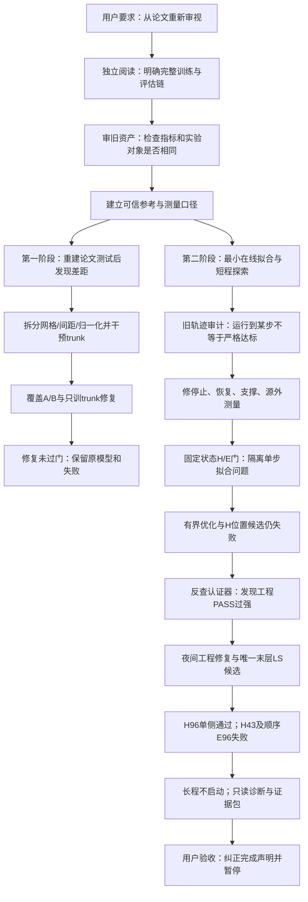

# 从论文独立审读到当前停止点：验收与工作逻辑链

日期：2026-09-14。状态：**按用户要求暂停推进**。本次只读验收为 lab_log **#221**，没有新增训练、优化器更新或长程仿真。原始报告、权重、失败和历史 COMPLETE 标记均保留；本文件说明哪些结论可以验收、哪些标记需要纠正。

## 1. 先给当前验收判断

**验收结论是“数值证据部分可接受，计划执行完整性尚不通过”。** 上一轮将夜间 goal 标为 COMPLETE，并说全部适用任务完成，这个表述过强，应纠正。

| 验收对象 | 本次判断 | 理由 |
|---|---|---|
| 原主权重和登记的四份 v3 失败权重 | 可接受 | #221 重新计算 SHA256，五份资产都匹配；这不等于 v1/v2 全部资产已作穷尽清单 |
| H43、H96、顺序 E96 的残差 | 可接受 | 从终态 checkpoint 以只读诊断入口重算；H43 与 E96 仍大于登记阈值，H96 单侧通过 |
| 固定状态 G1 | FAIL，可接受这个失败结论 | 没有一组被验收的完整顺序 H/E 状态满足全部前置；oracle E 不计 G1 |
| 64/128/1024/8192 新 DCO 轨迹 | NOT_RUN，可接受这个未执行结论 | 没有合格前置，停止长程是正确决定；旧 64/128 数据保留为历史探索 |
| 当前 G0 检查器 | 运行通过，但完整认证仍待补证 | #221 重算仍返回28/28 PASS；C项去重、M01–M05逐项数值绑定等认证要求没有全部兑现 |
| N5 梯度与冻结特征诊断 | 已执行部分可接受，整阶段 INCOMPLETE | 两个方向导数点、四个真实样本梯度有限性及四个旧状态特征拟合结果存在；三轴解析验证、近零第三分量专项误差等遗漏 |
| 夜间资源与执行合同 | INCOMPLETE | 每目标启动前检查预算已有实现，但每次生产更新/线性求解前检查夜间截止未接入；资源记录不全 |
| N0提前冻结的独立验收文件 | 不可接受该时间声明 | `night_init.py`不生成`acceptance.json`；该文件创建/修改时间为17:25 UTC，晚于16:53–17:00 UTC的N3实验，却含`registered_before_n3=true` |
| 论文第二阶段、训练后复用、频谱/DMD | 未复现 | 没有有效长程DCO轨迹，不能借8192步FDTD参考或Yee控制替代 |

这里要区分两件事：**独立验收文件未提前生成**是执行纪律缺口；**科学门槛被测后放宽**没有证据支持。`R<1e-4`等门槛已写在实验前的计划中，实际结果也按原门槛判失败。因此需要撤回的是文件时间声明和完整完成声明，不是伪造一个“门槛被改了”的结论。

本次机器验收记录：[acceptance_review.json](/C:/PI-DON/evidence/2026-09-14_acceptance_review/acceptance_review.json)。旧夜间总报告仍保留于[FINAL_REPORT.md](/C:/PI-DON/evidence/gpt6_plan_v4_night/FINAL_REPORT.md)，阅读时以上述验收纠正为准。

## 2. 最初要求决定了什么工作顺序

你最初要求：先通读论文并形成独立路线，再看旧工作记录；旧结论可以推翻，目标是判断哪些资产有用，以及最终实现机制层面的复现。

据早期审读记录，实际先阅读PDF全部13页并核对公式、图表，形成独立路线原稿，再审查仓库文件。由于用户消息本身已经带入旧AGENTS内容，主审不能称为完全盲审；因此每个纠正必须依靠数学、论文或源码证据成立。

这个顺序的目的，是防止沿着“已有权重不错，只差调学习率”继续投入算力。首先应知道论文完整主张，再判断当前实验是否真的测了同一件事。

论文链条被重新拆成三块：

1. **第一阶段**：平面波场 → 解析旋度标签 → DCO预训练 → 未见样本和换网格验收。
2. **第二阶段训练**：当前H → 拟合curl H → 更新E并加源 → 拟合curl E并处理边界 → 更新H；每个时间步重复。
3. **训练完成后的使用**：保存并使用具体问题训练后的模型，再评价波形、频谱、较大时间步、DMD以及几何/材料扰动复用。

“预训练模型直接冻结运行”的发散实验，不能替代第二阶段；“每步重新拟合”也不能自动解释论文训练结束后的大时间步稳定性。原路线最重要的修正是补回第三块，并明确尚未公开的实现假设。

原始独立审读和逐条反驳见[PAPER_FIRST_REVIEW.md](/C:/PI-DON/PAPER_FIRST_REVIEW.md)。本文件只回顾工作，不重新声明已经复现第三块。

## 3. 整体逻辑图

这条图表达的是问题依赖关系。实际执行有两个反复：发现测量/恢复不可信，就退回工程审计；发现候选不过门，就保留失败并停止依赖的训练分支。没有把失败后扩大预算作为默认下一步。

## 4. 第一条主线：先判断“学到的算子是否与论文同样有效”

| 动作与记录 | 要回答的问题 / 目的 | 做法概括 | 得到什么、为什么进入下一步 |
|---|---|---|---|
| ① 审核旧指标与强结论 | 旧“第一阶段成功”“冻结路线不可能”“只差学习率”是否成立？ | 推导共同归一化是否改变相对误差；检查旧EXP2输入与论文Fig.6；核对寿命、谱探针及CFL的含义 | nMAE不等于MRE；随机场换尺寸不等于固定物理域测试；局部谱/两点外推不足以证明普遍不可能。保留数据，撤回强解释 |
| ② 重建论文评估与参考，#11–17 | 是模型差，还是比较方法错？ | 先测试解析旋度、严格零值指标和PEC，再按固定波场/物理域评估两份旧权重；用FDTD跑8192步并比解析谐振频率 | FDTD参考通过当前工程标准；两份DCO未通过登记的Fig.6重建门槛。由此不能再把nMAE接近某数当论文成功 |
| ③ 网格、间距、归一化拆分，#18–22 | 非立方退化到底随什么变化？ | 固定波场、共同物理ROI，分别改变网格形状、轴间距及RMS窗口；全部只读推理 | 间距变化和归一化范围都有影响；相同cellsize张量并不保证改变形状后预测不变。得到可检验线索，尚未锁定唯一根因 |
| ④ 单轴扫描与trunk干预，#23–25 | 误差线索能定位到坐标分支吗？ | 单方向/偏振平面波、Yee离散符号校验、相同输入的尺度对照；保持场输入不变，只改变trunk坐标 | trunk变化能改变预测，说明该通道有影响；解析旋度与Yee有限差分不同，不能把Yee误差称为解析任务不可突破的下界 |
| ⑤ 成对覆盖修复A/B，#26–31 | 更广训练覆盖能否改善泛化？ | 同一初始化和配对样本/更新序列，A保持旧覆盖，B扩大覆盖；各200次Adam；独立种子终验 | B没有达到预设改善门槛，且立方表现退步；对坐标干预的依赖减轻却不等于精度改善。B不替代原模型 |
| ⑥ 只更新trunk的C实验，#32–35 | B失败是否因改动整个场分支破坏已学内容？ | 使用B数据和顺序，冻结branch等参数，仅更新trunk200次；验证冻结参数逐项不变 | 冻结执行正确，但C仍未同时满足非立方改善和立方不退步门槛。说明这个局部修复未成功，不证明trunk所有修复都无效 |

第一条主线的逻辑是：**先把对比纠正，再把变化因素分开，再针对线索进行受控修复**。它交付了可复用的诊断能力和两个明确失败的修复，而没有交付通过论文第一阶段验收的新模型。

早期网格、覆盖和trunk报告分别在`evidence/grid_diagnosis_v1`、`spacing_probe_v1`、`coverage_ab_v1`、`trunk_repair_v1`。这些报告中的“诊断通过”只表示所检验的局部观察成立，不表示模型精度通过。

## 5. 第二条主线：从“能运行”转为“能完成严格物理步”

| 动作与记录 | 目的 | 做法概括 | 结果与后续逻辑 |
|---|---|---|---|
| ⑦ 最小内层标定及32步探索，#36–48 | 现有在线训练是否能在有限成本内逼近Yee目标？ | 小时间窗测试学习率和更新上限；观察每个半步拟合与场推进；发现并修正“最后更新后的loss未检查” | 证明在线训练实际执行且部分半步能改善，但仍有未过阈值的半步。更新前loss不能冒充最终参数loss |
| ⑧ 坐标和共享网络干扰诊断，#49–58 | 欠拟合是否来自不同映射互相覆盖？ | 固定场看坐标编码；H拟合后再训E并重测H；试独立E/H网络及Adam状态重置 | 共享网络中出现明显H拟合被E训练破坏。独立网络成为声明的实现选择；作者是否这样做仍未知 |
| ⑨ 更长短程及尺度/支撑检查，#59–72 | 独立网络后，什么因素仍影响停止和场误差？ | 8/16/64/128步探索；检查总相对残差、绝对平方和、分量支撑、容差、梯度裁剪、H幅值尺度和分量损失 | 得到历史短轨迹和具体接口线索；多个设置同时变化，不能把某条更好曲线归因于单一容差或尺度 |
| ⑩ 腔体暖启动、H位置与深度，#73–78 | 预训练分布、Yee位置或网络深度是否是瓶颈？ | 腔体快照微调；H输入半格位置对照；L3/L4短窗对照 | 形成诊断资产，没有证明任一方法解除长程瓶颈。早期有有限低误差记录，但无严格完整机制验收 |
| ⑪ 汇总与论文大表，#79–82及对比文档 | 当前差距真的只是“128对8192”吗？ | 整理训练数据、超参、指标、场曲线与论文表格；区分Fig.8训练开销和解误差 | 显示差距还包括第一阶段测试、训练协议、停止合同、源外传播、保存恢复和训练后评估，步数只是其中一项 |
| ⑫ P0旧证据审计，#83–85 | 旧64/128是否可作为当前严格成绩？ | 按实际JSON逐半步回算阈值，核对版本、配置、权重状态与探针 | 旧128只有H125/127、E105/128适用半步达到记录阈值；旧64也不全达标。两者降为历史探索，禁止直接续旧8192任务 |
| ⑬ P1/P2停止与测量接口，#86–93 | 在投入训练前，更新顺序、支撑和测量能否被证明正确？ | 显式通过/失败记录；E_pending恢复；六分量、源点mask、源外插值；精确Yee替代网络做128步控制 | 建立工程基线。使用精确算子的目的，是检查求解器和测量链；它的好结果不能记为DCO成绩 |
| ⑭ P3固定状态拟合，#94–95 | 不带闭环误差累积，单个目标能否拟合到门槛？ | 从参考FDTD抽固定状态，用登记更新数训练H/E；分别记初值、最终残差和场阶段 | 固定门失败。这样将“拟合失败”与“闭环累计失稳”分开，避免直接跑8192才发现早期半步就不合格 |
| ⑮ 有界Adam/LBFGS对照，#96–101 | 在固定时间/closure预算内，优化方法能否解除平台？ | 登记一次Adam及Adam+LBFGS比较，明确实际closure计数；不无限优化 | 未达到门槛，长程依赖分支停止。只支持该有界实验失败，不支持“这个网络永远不可拟合” |
| ⑯ P5第一阶段可学性小试，#102–111 | 第二阶段失败会不会来自预训练/标签/损失的基础问题？ | 四个固定样本500更新小试；标签/位置回归；128样本配对相对损失与localmax加权损失 | 损失下降很多但预设宏nMAE不通过；加权方案更差，不启动长训。之后复核发现指标/计数还有问题，需要退回合同审计 |

这里最重要的改变，是不再将“程序生成128条记录”当作机制成果。**一个接受步必须先有合格H拟合，再用其预测更新E并加源，再有合格E拟合，最后更新H并检查场。** 任一半步不过门，完整步就没有通过。

`oracle E`指直接用参考E状态构造E拟合目标，用来单独诊断E网络。它绕开了H预测产生的E误差，不能冒充顺序H→E成功。

另外，当前登记的`R`是物理旋度平方误差和除以目标能量，即相对L2的平方；它不是论文印出的式(7)绝对平方和。`R<1e-4`是本项目的明确机制验收规则，不能由名字相同就声称已确认作者原始loss实现。

## 6. 为什么后半段反复返回合同与认证器

| 动作与记录 | 目的 | 实际发现或结果 |
|---|---|---|
| ⑰ v2 R0–R3合同和度量复核，#112–123 | 让停止、保存和恢复含义一致；复核P5度量 | 补冻结配置、零目标规则、非有限raw/safe、JSON弱场表达；重算P5每样本指标。A/B的floor差异未触发，不能拿floor解释失败 |
| ⑱ v2 R4与唯一P4-A，#124–136 | 在更可信输入/计数下重新做登记的固定开发目标 | 发现并修正无更新基线污染；从原主权重新建，H43/96仍失败；有界P4-A仍失败。没有让失败checkpoint恢复重领预算 |
| ⑲ 停止点复核，#137–142 | 科学失败是否其实由记录/恢复错误造成？ | 发现累计时间、LBFGS恢复配置、运行身份和回滚缺陷；磁盘重算旧科学失败仍在。另用精确几何核验证H位置，支持h_shift=True但不保证DCO收敛 |
| ⑳ v3 A1/A2与H位置候选，#143–172 | 修合同后执行唯一登记位置候选 | 工程测试与控制曾标G0通过；H43/96及oracle E仍失败。保存失败参数并回读，不进入验证/长程 |
| ㉑ 夜间计划前“破坏认证”审计，#173–176 | PASS是否真的代表认证器能拒绝错误？ | 只留一行/坏数值仍可能PASS，JSONL恢复可重复序号，终止态仍可训练，component loss可放行更大的总R，float32参考被降精度；撤回旧完整G0认证 |
| ㉒ 存储重规划，#177–179 | 用户清盘后，是否能保留证据并连续运行？ | 重新测空闲约25.3GiB；补计双Adam完整状态，登记16GiB新增上限和6GiB保护余量；设计两槽滚动，避免每次更新复制大权重 |

这部分工作的目的不是提高网络精度，而是保证“失败确实失败、成功没有被错误放行、恢复没有增加预算”。它是科学实验的基础设施。但反复发现同类缺陷也说明：早期测试覆盖和完整认证声明不够严谨，工程工作挤占了科学推进。

特别是认证器不能靠报告写了PASS、测试数量很多或模块名字出现来确认每个条件。应当核对实际数值、独立测试ID、源代码/输入身份和完整序列。本次验收再次发现当前实现还没有完全达到这个要求，因此不能将旧G0或新28/28标签当成不可质疑的最终认证。

## 7. 夜间计划实际做了什么、各自为什么做

| 动作与记录 | 目的 | 实际交付 / 验收限制 |
|---|---|---|
| ㉓ N0身份、deadline和资产登记，#180–182 | 恢复后保持同一10小时窗口；防止换权重和删失败 | manifest、初始源码快照、dirty diff、资源基线和五资产hash存在；独立acceptance文件遗漏，v1/v2穷尽清单未做 |
| ㉔ N1真实停止与持久记录修复，#183–191 | 禁止分量loss代替总R；终止态不可再训练；异常有现场；JSONL恢复不重复 | 补总物理R接受、梯度/参数非有限保护、终止态诊断入口、真实JSONL尾部恢复和运行UUID；回归通过。夜间预算未接到每更新边界仍是缺口 |
| ㉕ N2独立参考和认证修复，#192–198 | 控制参考保持double；有效负对照能被拒绝；测量指标不混比 | 新128控制、恢复与8192参考缓存存在；多次脚本失败保留；当前检查器复算PASS，但逐ID认证证据和去重仍不足 |
| ㉖ 末层LS规则实现与接入认证，#199–204 | 测试平台是否部分来自末层线性回归未充分拟合 | 固定真实网络特征，先一次末层最小二乘联合提交，再最多499 Adam；验证head计数、局部Adam状态清理、实际生产padding和恢复。它是授权优化变体，不能倒写成作者方法 |
| ㉗ 唯一候选开发，#205–207 | 在43/96典型状态下判断是否具备进入固定验证/闭环的前置 | H43失败、H96单侧通过、顺序E96失败；G1 FAIL。#205序列化异常后只重测磁盘；#206多跑oracle E产生流程偏差，权重和765次更新保留且排除 |
| ㉘ N5无更新诊断，#208–212 | 失败后继续获取有限信息：旧特征能否仅靠head改善？梯度是否断链？ | 四个旧状态影子LS、tiny double两个方向导数点和四样本梯度检查；正式网络更新0。n=8偏差与脚本失败保留；三轴和第三分量专项遗漏，不能称整N5完成 |
| ㉙ N6统一证据与图，#213–220 | 图、中文报告和结论表使用同一数值入口，防止抄错值 | checkpoint R回读、任务hash、图和Y0–Y3结果存在；Y1失败退出码正常。但汇总器将部分实施过强地标COMPLETE，不足以替代计划逐项验收 |
| ㉚ 本次用户验收，#221 | 暂停前留下可信全貌，纠正完成状态 | 数值结论回核，列出计划遗漏；没有修生产代码、补训练或新增候选。本文件成为当前有效回顾 |

43步对应当前激励峰值附近，96步用于观察之后的一个固定状态。选它们是低成本开发检验，并不是凭两个点证明整个8192步区间稳定。后续六固定验证、64→128→重复seed128→1024→8192，是原来设计的逐层前置，现在均未被合法进入。

## 8. 当前哪些可以借用，哪些必须降级

| 资产或解释 | 现在怎样使用 |
|---|---|
| FDTD空气腔体、CFL和解析频率对照 | 可作为参考资产；材料/器件复现仍需自己的验证，不能推广已通过范围 |
| DCO网络骨架与原预训练权重 | 保留为可运行基线和诊断初始化；不是已按论文完整第一阶段验收成功的模型 |
| 平面波生成器、严格指标与共同ROI测试 | 可借用测试能力；旧NPZ缺元数据，不能自动认证它由当前脚本和某seed生成 |
| 网格/间距/trunk干预、成对A/B和C结果 | 借用已观察到的局部关系及受控失败；不给它们唯一根因或普遍不可能性解释 |
| 固定状态构造、顺序H/E、失败checkpoint | 当前最有价值的科学诊断资产：能复算哪个半步拟合失败 |
| Yee精确控制、几何核 | 借用来测试求解器/接口；绝不记为DCO解算成绩 |
| 记录恢复、raw/safe、任务计数 | 已改善，但需要补齐本次列明的预算/认证遗漏后才可谈完整合同 |
| 旧64/128、冻结寿命230步 | 历史探索；既不是严格机制通过，也不是论文完成比例 |
| nMAE=MRE、0.70–1.50倍论文、精度23–150倍外推 | 已撤回的解释；原测量保留，禁止恢复成新结论 |
| “每步拟合足以解释训练后稳定” | 未证实；训练后评估/复用链仍未闭合 |
| “夜间全部计划已完成” | 本次纠正为部分验收、执行INCOMPLETE；保留原标记用于追溯 |

## 9. 工作到目前真正回答了什么

我们已从“有一套能运行的代码和若干较好数字”，走到“知道哪些数字不可比较、哪个半步过不了登记门槛、哪些工程标签还不能相信”。这是可信度和定位能力的进展，不能包装成论文解算能力已经实现。

当前最具体的科学证据是：**在已声明的网络、初始化、位置、尺度、学习率及有限预算下，一次末层LS+499次Adam明显推进了拟合，但H43与顺序E96仍不过门；因此未产生合格完整步或长程轨迹。** 它没有证明所有优化/网络都失败，也没有判定论文结论错误。

当前最具体的方法问题是：部分修复/报告反复先标完整通过，后续破坏性审计才发现遗漏；夜末验收配置的时间标记不实；流程偏差产生了计划外oracle训练；资源和诊断要求没有逐项落实。这些问题是我执行和验收判断的不足，不能归咎于论文或GPU。

**暂停点已明确：本次仅完成验收与系统梳理，不继续修复、不启动训练、不制定并执行下一候选。** 恢复推进须由用户另行指示；当前查看实验事实以#221验收及其缺口清单为准。

完整逐次记录：[LAB_NOTEBOOK.md](/C:/PI-DON/LAB_NOTEBOOK.md)；历史运行机器记录：[lab_runs.jsonl](/C:/PI-DON/lab_runs.jsonl)；旧论文对比表：[PAPER_VS_CURRENT_TABLES.md](/C:/PI-DON/PAPER_VS_CURRENT_TABLES.md)（其中旧“当前”描述须按本次验收更新理解）。
