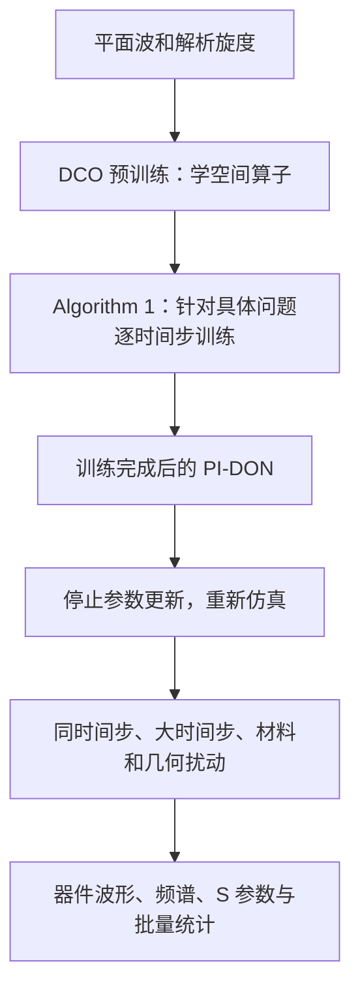

# 论文优先的独立复现路线与现有工作审查

审查日期：2026-09-12。

## 结论先行

**现有工作不是全部无用，但“第一阶段已经按论文验收成功”“已经定量证明冻结路线不可能”“第二阶段只需找对学习率”这三项结论，均不足以由当前证据支持。**

建议保留参考求解器、网络骨架、解析数据生成器、原始权重/结果和日志，重建论文对标实验与第二阶段的接口、停止判据及训练后评估。先做能排除基础错误的小实验，再决定哪些权重值得续训。现在没有依据直接删除整个仓库，也没有依据照 STATUS 的既定方向投入长时间训练。

### 审查过程与证据范围

1. 先通读用户 PDF 的全部 13 页（3800–3812），并观察所有页面，核对公式、图和表。两名未接收会话历史的审读者亦独立审读。
2. 在读取仓库之前，先写下[独立路线原稿](C:/Users/DELL/.codex/visualizations/2026/09/12/01a094fa-eb0f-7061-abd2-ef29a99e5018/paper_review/01_PAPER_FIRST_PLAN.md)，然后才读取 AGENTS.md、STATUS.md、CLAUDE.md。
3. 继续只读检查 PAPER_NOTES.md、RESULTS.md、REPORT_20260911.md、核心实现、统计脚本和部分既有产物。用户先前消息已经贴出 AGENTS 内容，所以不能声称主审者完全盲审；本报告每个反驳均须靠原文、公式或代码独立成立。
4. 本次是阅读、推导和静态代码审计，**没有重跑网络训练、长时程仿真或全套 verify_claims**。下文缓存数字标为已有产物读取，不能理解为这次重新获得的实验结果。原有 RESULTS.md 在审查开始时已有未提交修改，本报告没有覆盖它。

论文原件：[Qi & Sarris, PI-DON, 2025](C:/Users/DELL/Desktop/文献/神经算子/Physics-Informed_Deep_Operator_Network_for_3-D_Time-Domain_Electromagnetic_Modeling.pdf)。以下论文页码为期刊页码。仓库链接对应本次读到的代码。

## 一、全文实际需要复现的链条

论文称两个训练阶段，但复现时必须另列第三块“训练完成后的使用与验收”。

- **III：DCO 预训练。** 输入场与坐标，以解析旋度为标签。改造的双编码器 3-D U-Net，四层为主，GELU、残差、Hadamard 合并、上下采样及跳跃连接。
- **IV-A：特定问题训练。** Algorithm 1 每步训练 curl H → 更新 E → 加源 → 训练 curl E（带边界）→ 更新 H。第4、7步的训练终止条件写为 loss < 1e-4。
- **IV-B、V、VI：训练后评估与复用。** 腔体训练8192步后以大时间步评估1638步；微带器件的扰动仿真明确无需 further training；SRR 使用训练好的模型做大时间步和1512个扰动案例。

因此，“只做平面波预训练就冻结”是负对照；“完成具体问题训练后不再更新参数”是论文正式主张，二者不能混为一谈。论文没有给出完整的评估伪代码，最后一份权重、随时间保存的一组权重或其他具体复用方法仍应向作者核实。通常的冻结最后权重实现应写成显式假设，而非假装论文给出了所有细节。

论文的**训练时受 CFL 约束**与**评估时声称可超过 CFL**也必须分开。不能用“每步重新拟合”解释训练后大时间步评估的全部稳定性。

## 二、需要撤回或降级的旧结论

### 1. “最大值归一化使式(5)变成 nMAE”是数学错误

论文3803页式(5)非零真值处定义的是逐点相对误差。预测与真值共同除以同一个尺度 s，有

\[
\left|\frac{y_p/s-y_t/s}{y_t/s}\right|
=\left|\frac{y_p-y_t}{y_t}\right|.
\]

尺度抵消，分母不会变成最大值。归一化能改善网络训练，并不会改变相对误差的定义。

“光滑场经过零点，所以不可能取得很小的逐点 MRE”同样不成立。例如令预测满足 \(y_p=(1+\delta)y_t\)，每个非零点的相对误差都是 \(|\delta|\)，精确零点预测亦为零；δ 可以任意小。实际网络在近零点误差大，是具体模型的误差特征，不能据此证明作者必然换过指标。

现有缓存中，同一32³测试的指标如下（读取现存 NPZ，未重新推理）：

| 缓存 | nMAE | 式(5)实现所得 MRE |
|---|---:|---:|
| [test_results_dco_paper32.npz](C:/PI-DON/test_results_dco_paper32.npz) | 0.0047380196 | 0.3096583355 |
| [test_results_dco_lr1e3_300.npz](C:/PI-DON/test_results_dco_lr1e3_300.npz) | 0.0027908437 | 0.2043942343 |

这说明两列不是同一个量；**不能把此表直接拿去对论文 Table I 计算倍数**，因为测试样本与聚合也不一致。旧的“0.70×–1.50×论文”“只差3.6倍”等跨指标比较须撤回，原始 nMAE 本身可以保留。

代码定位：[dco.py:206](C:/PI-DON/dco.py:206)、[dco.py:234](C:/PI-DON/dco.py:234)、[test_dco.py:186](C:/PI-DON/test_dco.py:186)、[verify_claims.py:351](C:/PI-DON/verify_claims.py:351)。同一代码文件中还保留了互相矛盾的解释：有的注释称式(5)才可比较，有的称 nMAE 才可比较。这种文字冲突会继续误导后续工作。

正确处理：原样报告论文 MRE；另报 nMAE、相对L2和近零点诊断。式(5)的零值分支带绝对量、local maximum 的具体范围和聚合方式仍属于待澄清项，不能自行替作者确定。

### 2. 现有 EXP2 没有复现 Fig.6 的同一测试

论文3804页 III-D：沿用 Fig.5 的固定波场参数，在三方向总长均为19.2mm的域上换输入尺寸。Fig.5 用 θ=45°、φ=60°、20个 k 从0.021至838.34。

当前 [test_dco.py:165](C:/PI-DON/test_dco.py:165) 每个尺寸改 seed，重新调用 `build_data(4,n)`；[gen_data.py:153](C:/PI-DON/gen_data.py:153) 继续随机抽0.3–0.8mm网格间距。因此波场、物理域尺寸、网格间距都在变化。它能展示模型在另外一些尺寸上前向运行并产生一定误差，不能称为 Fig.6 的直接重现。

聚合还不相同：当前 nMAE 把三分量共用一个最大值；论文说按分量归一化，Fig.6展示x分量，但图中 MRE 是否仅统计x没有完整说明。应同时保存各分量和明确聚合结果，而不是任取较接近的列。

### 3. “论文指定直接 cellsize 输入”是把用途推成实现

论文 III-A 说 trunk 从坐标信息解码出网格尺寸；III-C、IV-A明确说输入坐标。它没有说输入必须是空间上常量的 `(dx,dy,dz)` 三通道。

[dco.py:246](C:/PI-DON/dco.py:246) 已有 abs、centered、cellsize 三种模式，这是可复用的消融能力。物理坐标模式更贴近文字；cellsize 可作为合理工程变体，但不应贴上“论文明确指定”的标签。坐标的单位、标准化与Yee偏移仍未完整披露。

### 4. “32 cells必然是32点”应改成有数值支持的解释

论文3805页实际写“32 cells”，没有给出“32节点”的定义。按照50mm均匀空气立方体，32间隔的CFL上限约3.0091ps，31间隔约3.1062ps；论文3.075ps接近第二种解释的0.99 CFL。这强烈支持采用31间隔作为候选实现，但不足以把原文歧义消除为确定事实。III-D的32、0.6mm和19.2mm又须单独核对。

在当前FDTD中避免越过所用网格的CFL，是正确的工程要求；“论文究竟怎样定义网格”与“本实现用什么才稳定”是两个问题。

### 5. “精度再提高23–150倍仍不行”不是判决性证据

[STATUS.md:48](C:/PI-DON/STATUS.md:48) 从两份checkpoint拟合幂律，外推至8192步，又把 nMAE 与另一种残差 ε 相连。这有四个问题：

1. 两点可以精确确定一条幂律，无法检验幂律是否正确，更无法提供可信的远距离外推区间。
2. 改学习率和训练过程会同时改变误差方向、频谱、边界行为和参数状态；不等于仅操纵一个“精度变量”的因果实验。
3. nMAE、相对L2、每步强迫残差、局部Jacobian谱半径不是同一个量。
4. 被试对象是预训练后直接冻结的模型，不是经过 Algorithm1 完整训练后的模型。

“23–150倍”不是有统计覆盖意义的上下界，只是依赖不同假设的估算，不能据此取消论文训练后复用的路线。

**158/230步也不是准确求解时长。** [test_dco.py:314](C:/PI-DON/test_dco.py:314) 按单个探针幅值超过热身峰值1000倍停止。旧基线日志 [LAB_NOTEBOOK.md:129](C:/PI-DON/LAB_NOTEBOOK.md:129) 已记录更早的误差超阈时刻：8步超过1%、34步超过5%、51步超过20%。这些旧记录仍需按同一实验定义理解；它们已经足以说明“直到158步才失败”不能等于“前158步都准确”。用230/8192报复现完成比例不成立。

### 6. 谱分析有诊断价值，但多项因果和不可能性结论过强

| 旧结论 | 审查判断 |
|---|---|
| C2：ρ能预测寿命 | 相关性是探索线索，不是校准正确或因果证明；实际预测器还使用初始误差 ε0。 |
| C3：减小dt完全无效 | 可作为特定模型、被测时间步范围和阈值下的观察，不能覆盖全部学得算子。 |
| C4：精度只通过ρ起作用 | [verify_claims.py:237](C:/PI-DON/verify_claims.py:237) 仅比较两个偏相关绝对值，不足以证明“只通过”的因果链。 |
| C5：规模可替代物理损失 | 两个多方面设置不同的模型局部ρ接近，不能证明可替代论文Algorithm1。 |
| C8：无约束学习算子做不了长积分 | [verify_claims.py:312](C:/PI-DON/verify_claims.py:312) 有数据就直接返回PASS；检查器没有检验普遍不可能性。 |
| C7：不利反例 | 应继续保留，不应因修正主张而删除原始反例。 |

谱探针的被测对象也需重新命名：[spectral_dco.py:76](C:/PI-DON/spectral_dco.py:76) 等处测量的是特定冻结状态附近的Jacobian，采用周期参考旋度、单侧替换curl E，curl H仍精确。网络卷积却有零padding；这与完整PEC腔体、两个旋度均训练的求解器不同。局部谱不是非线性全过程的全局稳定性。

还有确定的阈值实现问题：[spectral_dco.py:164](C:/PI-DON/spectral_dco.py:164) 先把误差超过1的时间写入 `blow`，随后误差超过1000时又覆盖它；预测公式却预测达到1的时间。字段含义可能随观察窗改变，而缓存未保存足够的完整误差轨迹来恢复所有样本的统一阈值。应先修复定义，再重新计算相关性及dt扫描。

一般误差传播满足类似 \(e_{n+1}=A_ne_n+r_n\)。是否累积取决于传播矩阵乘积、残差方向、时间相关性和初始扰动。即使在线性标量模型 \(e_N=e_0\rho^N\) 中，达到阈值 Emax 的时间也是 \(N=\log(E_{max}/e_0)/\log\rho\)，并非只看ρ。`ε≤1/N`可以在附加假设下给出量级设计要求，不是所有闭环必须满足的定律。

### 7. 精确卷积与伴随构造可保留，但不能推出全部旧解释

`exact_stencil.py` 的12个非零权重构造是均匀网格标准Yee差分的良好参考工具。**论文第一阶段目标却是解析旋度**：中心交错差分的波数因子是 \(2\sin(kh/2)/h\)，解析导数是 k，一般有限kh时二者不相等。证明卷积精确实现Yee，不能证明它在第一阶段解析标签上零误差，也不能证明更多数据或优化一定无用。

介质不均匀也不会自动使Cartesian网格的curl差分失效；材料主要进入本构关系和场更新系数。材料界面处理、非均匀网格等确实可能增加复杂性，但不能统称“没有闭式旋度靶子”。

线性T下成对构造 \(C^TT^TTC\) 对称半正定有数学价值，但显式蛙跳仍受最大特征值决定的时间步上限。它不是无条件稳定。把非线性U-Net放到T的位置，还需要重新定义伴随/线性化与能量论证，不能直接套任意线性矩阵T的证明。

## 三、第二阶段当前代码的具体问题

### 已确认的实现问题

| 问题 | 证据与影响 |
|---|---|
| 自定义loss与论文同名阈值混用 | [pidon_solve.py:175](C:/PI-DON/pidon_solve.py:175) 默认平方残差和除以目标平方和，即相对L2的平方；式(7)印成平方和。达到或未达到这个1e-4，都不能直接判定作者阈值。 |
| 未达阈值仍继续推进 | [pidon_solve.py:177](C:/PI-DON/pidon_solve.py:177) 循环到max_inner就返回；step继续更新场。应显式记录是否通过，未通过的运行标为截断内层训练的变体。 |
| 最后一次参数更新后的loss未检查 | [pidon_solve.py:182](C:/PI-DON/pidon_solve.py:182) 的last在更新前计算，达到上限后使用更新后的out却返回旧last。这会污染“最终loss”和是否达标统计。 |
| 标定把迭代次数当作是否通过 | [pidon_solve.py:324](C:/PI-DON/pidon_solve.py:324) 用it<max_inner计成功，恰好最后一轮检查通过也会被算失败。应检查最终实际残差。 |
| 探针被设在硬源点 | [pidon_solve.py:208](C:/PI-DON/pidon_solve.py:208)、[pidon_solve.py:408](C:/PI-DON/pidon_solve.py:408) 都强制设置源点；[pidon_solve.py:414](C:/PI-DON/pidon_solve.py:414) 又读同一点作双方探针。重合主要是强制输入的结果，不能证明传播或谐振正确。全域nMAE是另一份证据，不受这个探针问题自动否定。 |
| 不保存训练后模型 | [pidon_solve.py:425](C:/PI-DON/pidon_solve.py:425) 以后只保存JSON，没有保存第二阶段权重及优化器；当前入口也没有独立的训练后评估流程。即使跑完8192步，也尚不能闭合论文复用链条。 |
| 网络与精确差分混合更新 | [pidon_solve.py:146](C:/PI-DON/pidon_solve.py:146) 等处只在各分量共同裁剪区域替换，其余切片用精确Yee值。代码已主动说明偏离；结果应标为混合实现，不能当成全域DCO。 |
| 参考腔体的eps_r参数未生效 | [fdtd.py:98](C:/PI-DON/fdtd.py:98) 两个分支都取1，且[fdtd.py:131](C:/PI-DON/fdtd.py:131)更新固定除以EPS0。空气腔体不受影响，但不能直接靠这个参数复现介质块。独立structured材料脚本的结果不因此自动失效。 |

### 值得优先验证、但尚不能认定为主因的接口差异

- **一个网络、同一coords交替拟合两类映射。** [pidon_solve.py:87](C:/PI-DON/pidon_solve.py:87) 只创建一个网络及Adam，E/H调用同一predict。Yee中curl E和curl H的输入、输出交错位置及前后差分不同，当前共同裁块的局部原点又不同。缺少明确的位置或类型信息，可能造成交替训练相互干扰。需要固定状态的独立/共享网络对照，不能只认定学习率太小。
- **延续自定义RMS/max幅度缩放。** 代码可以把单位还原，未发现简单的米/毫米1000倍混淆；但它并不是原文各分量输出最大值归一化的直接实现，论文还说第二阶段不再需要该输出归一化。必须将此处理登记为方案差异。
- **n=31复制padding到可池化尺寸**会通过多层感受野影响预测；不是只影响随后被裁掉的那一层。属于工程选择，要检查边界与内域误差。
- **PEC施加位置**：当前代码对更新后的切向E置零，从物理约束角度合理。论文“predicted tangential components”与curl loss的关系写得不够清楚，不能把任何一种实现假装成无歧义照抄。

排除一个容易误报的问题：DUT按E→源→H，而参考实现按H→E→源；从零初场且比较相应注源后E时，两者在精确旋度下可产生相同E序列，保存的H时间层不同。因此本次没有将其列为确定的E对照错位错误；后续比较H和能量时必须对齐半时间层。

## 四、论文自身也有必须认真面对的问题

### 式(7)的符号与索引

3805页原图x分量印成 \(\partial_z E_y-\partial_y E_z\)，与标准curl x相反；y、z却采用标准符号。并且输出索引与右侧交错差分的自然位置不一致。已排除纯文本抽取导致的错误。

对 \(E=(0,0,y)\)，标准curl为(1,0,0)，按印刷第一行则为(-1,0,0)。最合理的处理是：生产物理基线采用一致的标准符号与Yee位置，记录“对疑似排版错误的修正”；逐字版本仅作为诊断。不能推断作者程序也照错式运行。

### 大时间步稳定性没有被逐步拟合本身解释

若网络恰等于标准离散旋度，式(6)仍是蛙跳。对某一频率ω的无损离散模态，其放大因子满足

\[
\lambda^2-[2-(\omega\Delta t)^2]\lambda+1=0.
\]

必要的模态稳定范围是 \(|\omega\Delta t|\le2\)（等号端点还需考虑重根）。因此“旋度更准确”不会自动取消CFL。大时间步下的成功可能来自低频子空间、高频抑制或未披露的评估处理；要测机制及频散代价，不能凭这项疑点直接说实验造假。

论文Fig.9的DMD是存在的稳定性证据，但它是有限轨迹、所保留模式的证据，不能单独证明任意初值/扰动/时长下的无条件稳定。复现应同时看能量、扰动响应、波形、频谱，并检验DMD窗口和秩的敏感性。

### 要向作者核实的具体问题

1. 式(7)x符号和三个输出索引是否为排版错误？
2. 第二阶段loss的实际代码：求和/均方、单位、缩放及1e-4阈值？
3. E/H是否共享网络和优化器，坐标如何编码各交错位置？
4. 第二阶段优化器、学习率、状态继承和停止流程？
5. 第一阶段局部最大值的定义及推理时物理量还原方法？
6. MRE实际计算代码、分量/样本聚合及零值处理？
7. 训练完成后的推理伪代码、使用哪份权重、怎样改变时间步？
8. 腔体网格点/间隔、高斯源脉宽、DMD秩以及表II峰值估计方法？

补充检查了作者[项目页](https://shutong.space/Projects/)及[论文列表](https://shutong.space/publications/)，其中也强调训练后的几何/材料泛化。已查看页面没有提供可直接解决上述问题的代码链接；这不等价于断言作者没有公开代码。本次没有向作者发送消息。

## 五、哪些可以借用，哪些要重建

| 资产 | 建议 |
|---|---|
| fdtd.py、run_fdtd_cavity.py | 保留为候选物理基准；先按明确网格、源与频谱规则重新验收。旧的解析频率对照有价值，但本次未重跑。 |
| gen_data.py | 保留解析场/curl生成骨架；补原文固定案例；将4–16波、cosθ拒绝采样、取实部等补充假设写进数据元信息。 |
| dco.py | 保留核心结构与多种输入模式；重新命名哪些是论文约定、哪些是设计变体。 |
| train_dco.py | 可复用训练流程；正式对标用单独明确的论文配置。当前300epoch、batch16、cosine和相对loss不是原文设置。 |
| test_dco.py/评估函数 | 重点重建Fig5/6、逐分量指标、有效预测时长和跨网格一致测试。 |
| pidon_solve.py | 有Algorithm1顺序骨架；优先修复停止/日志/探针/权重保存，厘清两类curl接口与边界覆盖，再决定训练预算。 |
| spectral_dco.py | 保留为局部稳定性诊断；修复阈值，明确边界、被替换算子与线性化状态；不可直接当完整求解器全局证明。 |
| exact_stencil.py | 保留为离散算子单元检查，不作为解析curl学习已无必要的证明。 |
| structured*.py、symplectic.py | 单列自主探索；保留带条件的线性代数论证，停止将其包装为论文已复现或任意网络的无条件稳定。 |
| lab_log.py及原始产物 | 保留，进一步补输入文件和脏代码状态的可追溯性。存在哈希并不自动证明科学解释正确。 |
| verify_claims.py、RESULTS、PAPER_NOTES和汇报 | 需要按以上边界改写；自动返回PASS只说明预设检查通过，不能使不充分判据变充分。保留反例与历史记录。 |

额外元数据风险：[gen_data.py:191](C:/PI-DON/gen_data.py:191) 保存dirs，但 [train_dco.py:33](C:/PI-DON/train_dco.py:33) 不读取并传到checkpoint，保存项也缺少它。自动评估时可能把per-wave训练模型按shared方向分布测试，除非显式覆写选项。因此消融排名必须核对实际测试分布，不能仅凭配置名称。

记录存在不一致：当前本地 `lab_runs.jsonl`/LAB_NOTEBOOK 只有#1–#10，STATUS却引用#43–#46。相应部分权重和NPZ确实存在，不能说“没有数据”；只能说当前记录链不完整。230步在本地仍需查找对应日志及带checkpoint身份的完整轨迹。REPORT_20260911写“38%–54%子步达标、内层不是瓶颈”，STATUS又写“从未接近阈值、先标学习率”；这些旧判断要回到具体配置、真实源幅度和覆盖的物理时间统一解释。

另据只读加载，当前 `dco_paper32.pt` 的元数据是levels=4、base=32、grid=32、coords=cellsize、norm=rms、epoch=260，且hist缺少config。它不能仅凭文件名认作原文配置；epoch字段与部分历史描述也不一致。应核对该权重对应哪次训练/续训及原始哈希，再决定是否重用。这里没有据此推断所有历史结果都来自这份现存权重。

## 六、接下来真正应该做的复现方案

### G0：统一数学、单位、位置和判据

先建逐分量解析curl测试（常量、线性、单平面波）、两类Yee差分与PEC检查。统一E/H数组物理位置、时刻、单位和源；同时输出SSE/MSE/相对平方误差。为每个指标写清真值、分母、分量/空间/时间聚合。

先验收纯FDTD：50mm空腔，明确31或32间隔解释，使用与该网格一致的CFL内时间步；源外探针、300/600/900步切片、8192步频谱与解析模态。不能以“没NaN”代替精度验收。

### G1：重新建立第一阶段可比较的基线

按1000样本、32³、80/20、Adam lr1e-4、batch32、1000epochs形成原文配置；先以少量样本过拟合诊断检查实现，避免直接耗尽预算。现有权重先重评估，不必先重训全部模型。

固定Fig5案例，再在固定19.2mm三方向物理域上做Fig6三种尺寸。保存各分量原始预测及解析真值，报告MRE与辅助指标。局部最大值还原、复数表示、通道数等缺失项显式列为假设，必要时做少数有解释力的对照。

### G2：用固定的非平凡场状态确认内层可优化

挑选零场、激励建立、传播、反射等状态，分别固定curl H/curl E目标。先检验每种输入位置映射可以拟合，再比较交替使用共享网络是否互相破坏。在统一损失定义后扫描少数学习率/内迭代数，记录更新后真实loss、是否通过、步数、耗时和物理场误差。

不能只用源刚开始、幅度极低的20步判断“精度饱和”；不能将未达到自定义相对阈值解释为作者绝对阈值不可达。上一配置失败只能证伪该配置，不能直接证明网络表示能力不够。

### G3：完整腔体训练与图表验收

通过G2后按Algorithm1运行8192步。逐步记录两次训练的最终残差和通过状态，保存阶段2权重与完整配置。输出Fig7切片/误差图、源外探针波形、频谱和TableII；做随机初始化、含介质块的Fig8对照。

Fig8按每时间步内各epoch损失求和绘制，并单列真实优化次数及耗时。损失和降低不自动等于迭代次数减少，不能仅凭Fig8纵轴推算成本。

### G4：正式验收训练后的冻结使用

冻结完成G3的权重、重置初场，先同dt，然后5×CFL，仿真相同物理时长；核查没有参数更新。再测不同源、低幅高频扰动、不同物理窗口；同时比较能量/频谱/误差与DMD。预训练直接冻结仅作独立负对照。

若最后权重实现失败，先核实论文的评估协议，再决定是否属于方法不可复现。不能从预训练权重的失败越过这一关下结论。

### G5：器件与批量不确定性实验

| 对象 | 标称训练验收 | 训练后验收 |
|---|---|---|
| 微带低通 | 4096步，端口时序和S参数；原文MRE1.9e-3 | εr、d1、d3各10取值共1000组合；5×CFL；S参数均值、5%/95%分位数、6dB截止频率分布 |
| 分支线耦合器 | 4096步；四端口响应 | εr、L1、L2共1000组合；5×CFL；S参数和端口3/4相位差 |
| SRR/strip-wire | 48×64×200、.056mm；20000步，0–22GHz激励；原文MRE1.5e-3 | 5–80×CFL的精度扫描；40×CFL、1512次扰动；S参数与截止频率分布 |

补齐论文引用[33]及[35]/[36]的几何和网格，核对Mur式(9)、α日程式(10)、端口入反射分离和PEC/PMC适用激励。论文所称90%CI按文字实为输出分布5%/95%分位区间，并非均值估计的置信区间。

分开统计DCO预训练、具体问题训练、冻结推理、批量推理成本；记录硬件、显存和batch。GPU PI-DON与CPU FDTD的时间比不能直接解释为同硬件算法加速比。

### 验收图表应回答什么

- **波场与差值图**：正确方位与位置上，网络真的学到了旋度吗？
- **每步残差/通过率与迭代数图**：第二阶段是否按明确停止规则完成，而非因迭代上限被截断？
- **源外时序与频谱图**：算出的场是否有正确的传播和谐振，而非只是源点一致？
- **训练后冻结的能量/误差/扰动响应图**：无需再训练的大时间步主张是否成立？
- **S参数分位区间和成本随案例数变化图**：多次仿真时是否真的有实用收益？

每张图保存脚本、原始数组、checkpoint身份、指标定义和lab_log记录；先写判据，再出结果。反例与失败原样保留，但给它们正确的适用范围。

**建议的当前状态表述**：已经具备DCO训练、多尺寸推理、FDTD参考与若干结构探索的基础资产；第一阶段尚未完成按原文协议与指标的验收；第二阶段有实现骨架但存在控制、记录和接口问题；完成问题训练后的无再训练评估尚未由当前流程验证。

## 附：重新对标时使用的论文原始数字

这些数来自PDF原表，不是本项目本次实测。

| Table I层数 | 训练时间/s | MRE |
|---|---:|---:|
| 2 | 619 | 1.4e-2 |
| 3 | 662 | 5.3e-3 |
| 4 | 870 | 7.7e-4 |
| 5 | 978 | 7.9e-4 |

Fig6的64³、64×96×16、32×64×16分别标注MRE为4.1e-3、3.8e-3、4.7e-3。作者选用四层网络；III-B的归一化例子给7.9e-4，不能未经说明将它改写成四层的7.7e-4。

| Table II模式 | 解析/GHz | FDTD/GHz | PI-DON/GHz |
|---|---:|---:|---:|
| 110 | 4.243 | 4.242 | 4.240 |
| 211 | 7.349 | 7.344 | 7.344 |
| 221 | 9.000 | 8.997 | 8.997 |
| 310 | 9.487 | 9.482 | 9.482 |
| 321 | 11.225 | 11.223 | 11.223 |

8192步、3.075ps的直接FFT频点间距约39.7MHz；表中MHz量级的峰位必须交代估计方法。零填充可使画线更细，不能凭空增加独立频谱分辨能力。
