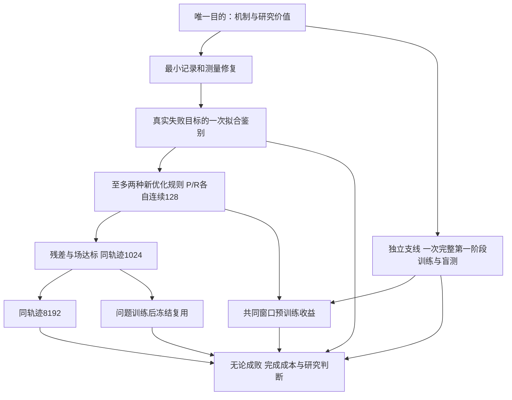

# PLAN — PI-DON 唯一总计划

更新：2026-09-15。机器任务状态：[project/plan.json](project/plan.json)。**M0/M1/M2/B/V已完成交付；M2有三条残差128轨迹，B-R2也完成残差128，但G128场门失败，因此不启动1024/8192。S1新完整训练尝试工程中断，未产生last/summary/盲测。B收益配对完成且FAIL。**

## 唯一目的与完成定义

**用可追溯证据复现“学旋度 → 每个时间步适配求解 → 得到可靠电磁场”的机制，并衡量预训练和复用收益，判断是否适合作为研究方向。**

最低机制目标：第一阶段在明确分布的未见场上成立；第二阶段连续1024步，覆盖论文300/600/900切片。完整工程目标：同一轨迹8192步，场与频谱达标。论文指标对齐、预训练收益、冻结复用各自评价；结果可以是否定的。

不以脚本数量、测试数量、训练更新数估算“复现百分比”。

## 目标差距总表

| 目标项 | 已有证据 | 仍缺什么 | 当前判定 |
|---|---|---|---|
| 论文与实现对应 | 论文独立推理、解析/位置/单位检查 | loss、坐标/归一化、训练后权重用法仍有假设 | 条件化实现，不等同逐项论文复现 |
| 第一阶段算子学习 | 旧16例12例宏nMAE≤1%；新S1尝试运行到epoch 937/23425更新，best开发宏nMAE 0.021945 | 无完整1000epoch终止、无last.pt/summary、无盲测/迁移验收 | 原S1 FAIL；新S1 INCOMPLETE |
| 每步优化收敛 | A-P、B-R、B-P均完成128个残差接受步；A-R失败于33步 | 长程前必须先过场门 | 残差128有候选 |
| 传播正确 | M2审计显示三条残差128候选有效分量最大nMAE约4.9%–5.1%，源外波形也未全≤5% | 后续若继续需先解决场误差，不得直接延长 | G128 FAIL |
| 1024/8192机制 | 参考FDTD已有，非DCO成绩 | 同一DCO轨迹连续达到长度、切片和频谱门槛 | NOT_RUN |
| 预训练收益B | B-P、B-R、B-R2均残差128完成；B-P Adam多于两个随机对照，场门也失败 | 无同精度场合格收益证据 | FAIL |
| 冻结复用U | 缺合格问题训练模型的复用证据 | 零场重启、原源与宽度×1.2新源，无参数更新 | NOT_RUN |
| 工程可信度 | M0已补当前新队列用到的计数、pending恢复和None指标报告；完整历史G0仍有缺口 | 后续出数继续受harness与lab_log约束 | 新队列局部工程PASS；不宣称完整G0 PASS |

当前数值和更正依据见 [STATUS](STATUS.md)。原始证据不因本表更新而改变。

## 主路线与独立支线

精确执行条件以详细计划为准。失败只结束本臂，不阻止另一初始化、另一已登记规则、第一阶段或成本分析。B/U失败也不取消已满足精度条件的长程机制验证。

| ID | 动作 | 简短理由 | 预期与验收 | 失败后去向 | 执行状态 |
|---|---|---|---|---|---|
| W0 | 核查1h/2h、分类目录、共同入口 | 消除成本和恢复误判，防新agent迷失 | 权重哈希保留、记录更正、入口和harness可用 | 先修导航问题 | 本轮交付，见整理报告 |
| M0 | 新队列的计数、受控暂停与测量小修复 | 不再出现尾部未知和恢复True硬编码 | pending恢复与不中断一致，成本/退出/科学状态分列 | 不依赖它的只读任务 | PASS；工程证据见`evidence/direct_mechanism_v1/m0/` |
| M1 | S-R第34候选E等固定输入鉴别 | 直接定位卡点，避免再扫学习率 | 参数前向R、投影残差/秩、尺度和梯度证据；阴性也是有效交付 | 新合法候选及S1 | PASS；诊断证据见`evidence/direct_mechanism_v1/m1/` |
| M2 | A/B新规则、独立P/R直接目标128 | 跨过已知困难区，减少4→8→16碎片实验 | 64中检，128残差+场+整段波形 | 另一规则、S1、V | PASS；残差128有候选但场门失败 |
| S1 | 单个固定方案完整预训练与盲测 | 第一阶段不能长期被在线局部问题挤掉 | 1000epoch，25,000真实更新上限；旧S1标准，MRE另列 | 保留失败，随机机制和V继续 | INCOMPLETE；见`s1_phase1`中断审计 |
| B | 相同规则与窗口的P/R收益 | 判断预训练是否真正节约求解成本 | 两随机seed；同精度，耗时和更新均改善≥20% | 无收益/缺证据不阻断长程 | PASS交付；科学FAIL |
| L1 | 同一合格新轨迹1024 | 覆盖论文切片及传播反射 | 原G2；300/600/900切片；增长风险检查 | L2不跑，其余独立任务继续 | NOT_RUN；G128未解锁 |
| L2 | 同一轨迹8192 | 判断完整论文长度 | 原G3场、频率、谱幅、能量 | 记录失败时间与限制 | NOT_RUN |
| U | 完成问题训练后的冻结复用 | 判断昂贵在线拟合之外的价值 | 原源→新源128→1024，不更新参数 | 阴性不否定在线证据 | NOT_RUN |
| V | 成本、局限、研究决策和交接 | 防“做了很多”代替“研究值得做” | 成功/失败/资源截断/NOT_RUN全表及证据链 | 全队列终结后交付 | PASS交付；科学FAIL |

## 科学验收与运行配额分开

- 非零半步严格R<1e-4；零靶固定尺度规则不变。残差合格不等于场合格。
- 活跃段去硬源Q≤5%，有效六分量nMAE≤1%，源外整段相对L2≤5%，A_fixed≤1e-3；弱场沿用全时长参考固定分母与1e-5绝对规则。
- 1024覆盖300/600/900切片，末128步RMS-Q不高于前128步2倍；8192五模频率对解析≤0.5%、对FDTD≤0.2%、可解析谱幅≤1dB、活跃能量偏差≤10%。
- 第一阶段、第二阶段、收益和复用分栏；论文式(5)MRE单列，不拿nMAE比较论文数字。
- 新计划取消会话1h/2h截止，改用首次更新前登记的有限更新、closure和存储配额。旧500/3000/240秒失败不改判，新预算只适用于新臂。

## 执行与退出

全部参数、种子、实验上限、门槛和prompt见 [直接机制执行计划](docs/plans/2026-09-14-direct-mechanism-plan.md)。

连续执行有前置的完整队列，不需例行确认；不得因单臂FAIL或暂不能8192结束全部任务。只因用户叫停、无法保存的资源故障、必须越出计划改变物理/网络定义，或登记分支全部终结并交付而结束。没有合格候选就交付阴性证据，不新增第三种扫参。

每次证据审核后同步PLAN、project/plan.json、STATUS，并在actions追加结果。新会话入口始终为AGENTS → PLAN → STATUS。
