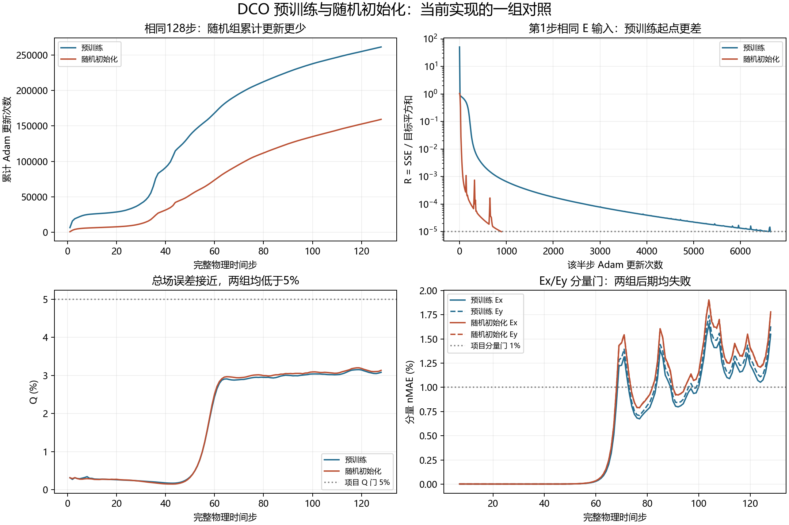

# DCO预训练价值：128步证据审计

本次仅读取、复算和绘图，参数更新为0。原始回传保存在`evidence\server_resource_v1\dco_value_review_20260916_r1\returned`。

| 指标 | 预训练初始化 | 随机初始化 |
|---|---:|---:|
| 完整时间步 | 128 | 128 |
| Adam更新 | 261209 | 159240 |
| 运行耗时（秒） | 11074.07 | 6837.28 |
| 交付状态 | PASS | PASS |
| 科学状态 | FAIL | FAIL |
| 128步Q (%) | 3.081131029001534 | 3.1334832459874784 |
| 首个分量门失败步 | 69 | 69 |
| 恢复资格 | False | False |

随机组更新少 39.04%，墙钟少 38.26%；两组最终场门均失败，不作同精度成功求解的加速认证。

## 第一个E半步

相同零初场、硬源波形、支持域和目标平方和；第一个H半步均为零输入直通。

| 指标 | 预训练 | 随机 |
|---|---:|---:|
| loss_initial | 50.69289779663086 | 1.0352354049682617 |
| target_ss | 1.9472423673505546e-08 | 1.9472423673505546e-08 |
| target_count | 89373 | 89373 |
| n_updates | 6647 | 891 |
| residual_ratio | 9.937310736450351e-06 | 9.993068929615519e-06 |

## 第128步六分量

nMAE与相对L2均用百分数；弱参考分量保留绝对误差。

| 分量 | 预训练 nMAE (%) | 随机 nMAE (%) | 预训练 absMAE | 随机 absMAE |
|---|---:|---:|---:|---:|
| Ex | 1.548602 | 1.780120 | 7.5735843e-06 | 8.7058463e-06 |
| Ey | 1.630759 | 1.770469 | 7.9753815e-06 | 8.6586454e-06 |
| Ez | 0.470945 | 0.481329 | 8.2972325e-06 | 8.4801766e-06 |
| Hx | 0.391016 | 0.415073 | 6.0080107e-06 | 6.3776583e-06 |
| Hy | 0.372246 | 0.404829 | 5.7196109e-06 | 6.2202599e-06 |
| Hz | 弱参考 | 弱参考 | 5.1964637e-06 | 6.231651e-06 |

## 源点与源外探针

源点为硬赋值，不能单独证明传播正确。所有数值均来自原始记录。

### 预训练

末步H/E残差：9.9935791e-06 / 9.9778766e-06。
源点：`{'dut': 2.0417117368923817e-29, 'ref': 2.041711680802609e-29}`

- [12.0, 12.0, 13.0]：128个样本整体相对L2=0.991368%；末步=`{'cells': [12.0, 12.0, 13.0], 'xyz_m': [0.01935483870967742, 0.01935483870967742, 0.020967741935483872], 'dut_Ez': 1.325353514403122e-05, 'ref_Ez': 2.170010452573489e-05}`
- [8.0, 10.0, 12.0]：128个样本整体相对L2=0.655843%；末步=`{'cells': [8.0, 10.0, 12.0], 'xyz_m': [0.012903225806451613, 0.016129032258064516, 0.01935483870967742], 'dut_Ez': 0.00020955311629222706, 'ref_Ez': 0.00021158561139600351}`
- [21.0, 19.0, 18.0]：128个样本整体相对L2=2.893196%；末步=`{'cells': [21.0, 19.0, 18.0], 'xyz_m': [0.03387096774193549, 0.03064516129032258, 0.02903225806451613], 'dut_Ez': 5.6975180996232436e-05, 'ref_Ez': 2.825936257977432e-05}`
### 随机

末步H/E残差：9.9799453e-06 / 9.9459383e-06。
源点：`{'dut': 2.0417117368923817e-29, 'ref': 2.041711680802609e-29}`

- [12.0, 12.0, 13.0]：128个样本整体相对L2=1.896695%；末步=`{'cells': [12.0, 12.0, 13.0], 'xyz_m': [0.01935483870967742, 0.01935483870967742, 0.020967741935483872], 'dut_Ez': 8.239723683800647e-06, 'ref_Ez': 2.170010452573489e-05}`
- [8.0, 10.0, 12.0]：128个样本整体相对L2=0.953277%；末步=`{'cells': [8.0, 10.0, 12.0], 'xyz_m': [0.012903225806451613, 0.016129032258064516, 0.01935483870967742], 'dut_Ez': 0.00022501539933728054, 'ref_Ez': 0.00021158561139600351}`
- [21.0, 19.0, 18.0]：128个样本整体相对L2=1.280767%；末步=`{'cells': [21.0, 19.0, 18.0], 'xyz_m': [0.03387096774193549, 0.03064516129032258, 0.02903225806451613], 'dut_Ez': 4.0602986700832756e-05, 'ref_Ez': 2.825936257977432e-05}`

## 审计范围

随机组lab #313，输出哈希核对 22 项；两组32/64/128快照指标均读回复算一致。
冻结配置仅init不同，记录的核心源码哈希一致。优化器每步重置，其step计数只核对最后半步；累计成本按逐步记录重算。

- One pretrained checkpoint and one random seed at 128; no population-level speed claim.
- Both 128 field gates fail; cost comparison is not successful same-accuracy solver certification.
- Random metadata master/row arm labels still name pretrained legacy defaults; init=random and init_sha256=null define actual initialization.
- No initial model snapshot before the first update; initialization verified through config, command and saved code, not a zero-step tensor hash.
- pidon_contract.py was not copied into returned source; local copy matches the production hash exactly after CRLF-to-LF conversion. Verified LF bytes saved here.
- Milestone saved fields remeasured; no forward/backward training run and no independent reconstruction of every inter-milestone field.
- Saved reference fields checked against saved metrics, not an independent accuracy certification of Yee against a continuum solution.
- Source-outside whole-window L2 reported as retrospective diagnostic, not a substituted registered active-window gate.
- No current checkpoint authorizes continuation: scientific FAIL and recovery_eligible=False.

